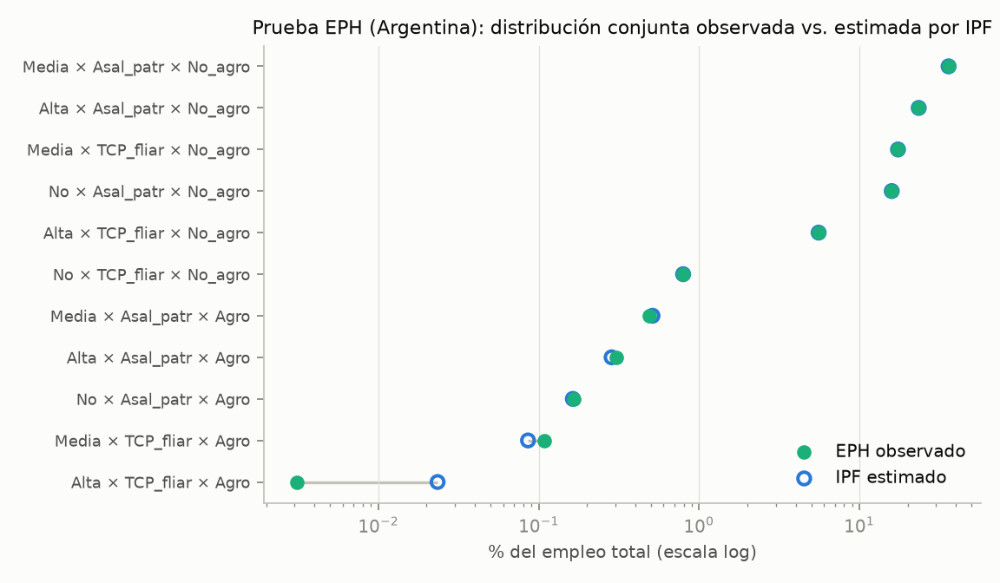
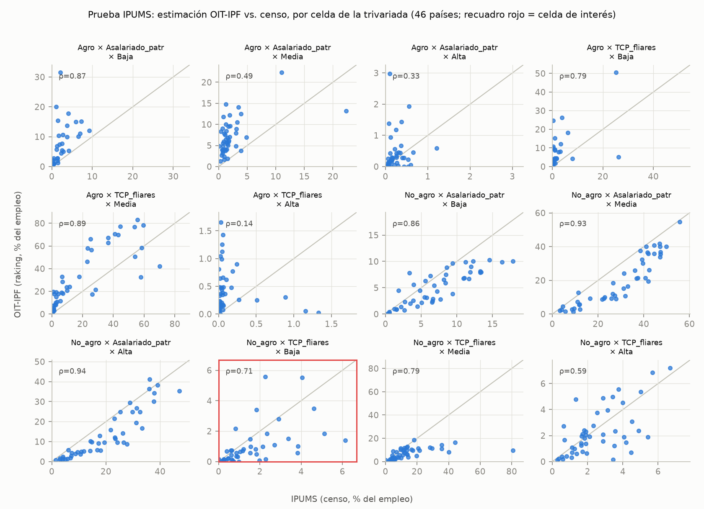
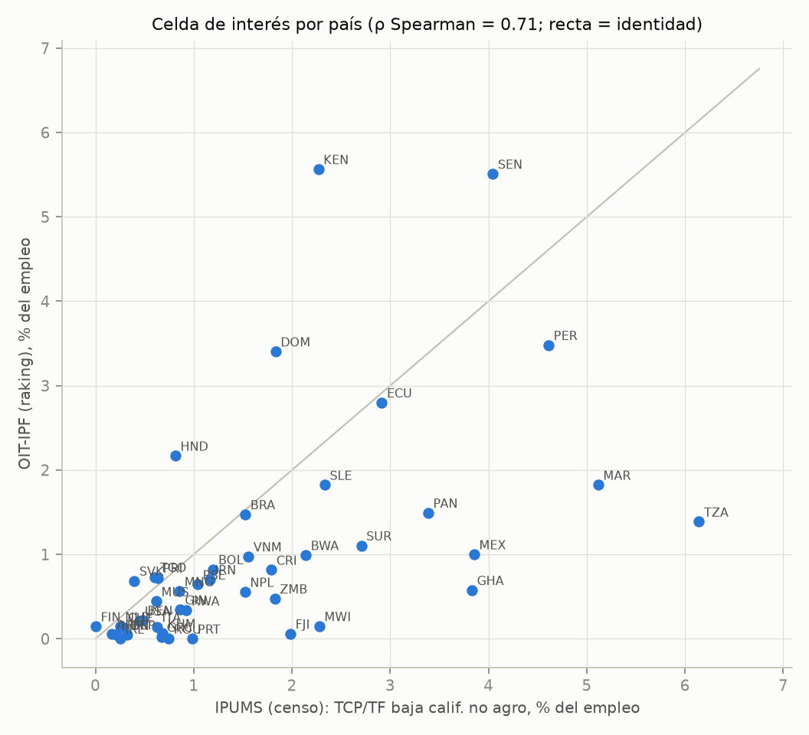
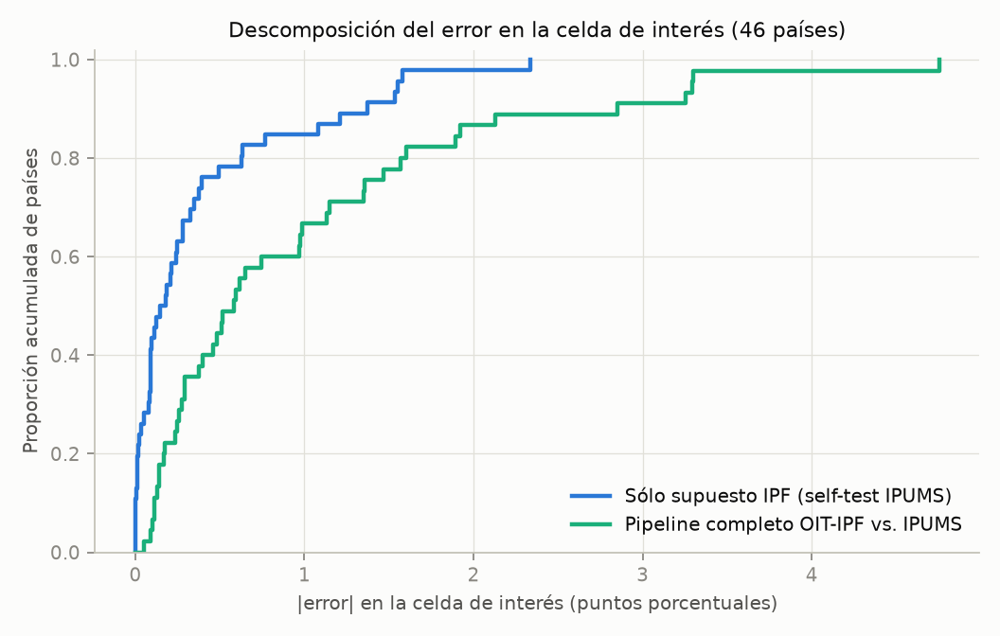
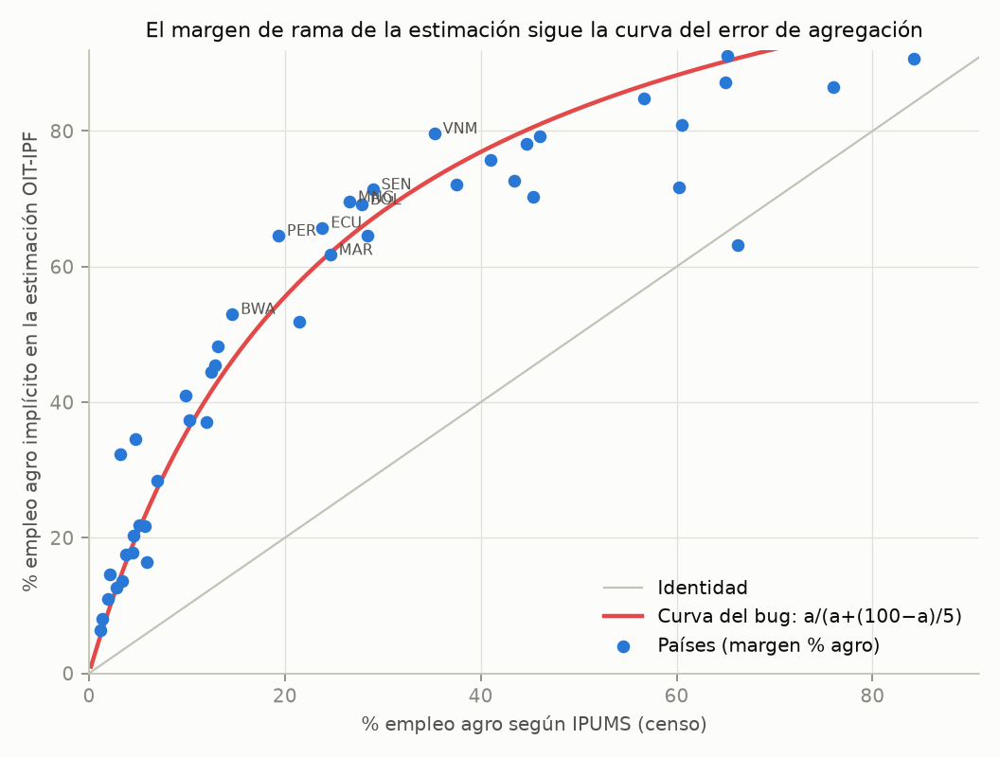

# Análisis de las pruebas de validación de la estimación IPF

**Estimación de trabajadores por cuenta propia y familiares (TCP/TF) de baja calificación, no agrícolas**

*Primer análisis — 2026-07-06. Código: `src/015_analisis_pruebas_ipf.py`. Salidas intermedias: `data/test_ipf/`.*

---

## 1. Resumen ejecutivo

1. **El método IPF funciona muy bien cuando los insumos son correctos.** En la prueba EPH (Argentina) el error máximo por celda es de 0,023 puntos porcentuales (pp) y el error relativo en la celda de interés es de 0,36%. En un *self-test* sobre las trivariadas censales de IPUMS (46 países), el supuesto de no-interacción de tercer orden introduce un error absoluto medio de solo 0,38 pp en la celda de interés, con ρ de Spearman = 0,90 entre valor verdadero y estimado.

2. **La estimación publicada (OIT-IPF) tiene un problema serio en los insumos, no en el método: un error de agregación en `src/011_preproc_estimacion_tcp_estancada.R` infla sistemáticamente el margen agro.** El margen de rama implícito en la estimación final excede al censal en +24,8 pp en promedio, y los países caen casi exactamente sobre la curva teórica del error `a/(a+(100−a)/5)` que resulta de *promediar* las ~5 categorías ECO que componen "No agro" en lugar de *sumarlas* (§6). Corregida esa transformación, los márgenes implícitos reproducen los valores conocidos de ILOSTAT (Perú 26,7% vs ~27%; Brasil 10,5% vs ~10%; Francia 2,8% vs 2,8%).

3. **Aun con ese sesgo, el ordenamiento de países en la celda de interés se preserva de manera aceptable** (ρ = 0,71 entre estimación OIT-IPF y censos IPUMS), aunque con subestimación media de −0,62 pp sobre una media censal de 1,62 pp. Es esperable que la corrección del punto 2 mejore sustancialmente el acuerdo: el margen "TCP/TF × No agro" calculado con la agregación correcta (script `013`) ya se acerca mucho más a IPUMS (MAE 5,6 pp; ρ = 0,85) que el mismo margen implícito en el IPF (MAE 8,9 pp; ρ = 0,70).

4. **El IPF de máxima entropía subestima estructuralmente la celda de interés.** En el self-test IPUMS el sesgo es −0,33 pp (los 6 países con mayor error son todos negativos): existe una interacción de tercer orden real —dentro del sector no agrícola, la condición de TCP/TF está *más* asociada a la baja calificación de lo que implican los márgenes bivariados—. La estimación debe leerse como **piso** de la celda, lo que es consistente con el criterio de "parámetro mínimo" del proyecto.

5. Se detectaron además dos defectos menores de código que afectan resultados publicados: la etiqueta `3-Alta`/`3.Alta` rompe el *join* de las celdas de calificación alta en `103_comp_ipums_raking.R`, y el *join* con `country_classification.csv` en `013` duplica 26 países en `tabla_tcps_final_sums.csv` (§7).

---

## 2. Diseño de validación: qué valida cada prueba

La estimación final por país tiene dos fuentes de error separables:

| Componente | Qué lo mide |
|---|---|
| **(a) Error de método**: el supuesto IPF de que la trivariada no tiene interacción de tercer orden más allá de sus tres márgenes bivariados | Prueba EPH (Argentina) y *self-test* IPF sobre las trivariadas IPUMS: los targets provienen de la misma fuente que la verdad, por lo que todo el error residual es atribuible al método |
| **(b) Error de insumos/pipeline**: calidad y consistencia de las tres tablas bivariadas de OIT, y su procesamiento en `011`/`012` | Comparación IPUMS vs estimación OIT-IPF, *neta* del componente (a) |

---

## 3. Prueba 1 — EPH (Argentina): validez interna del método

Insumo: `data/eph_ipf_comparacion_agg_test.csv` (las tres bivariadas reconstruidas desde la EPH, IPF re-estimado y comparado contra la conjunta observada).

| Celda (calif × cat. ocup × rama) | n muestral | % obs. (pond.) | % IPF | Dif. (pp) | Error rel. % |
|---|---:|---:|---:|---:|---:|
| Alta × Asal_patr × Agro | 97 | 0,305 | 0,285 | −0,020 | −6,7 |
| Alta × Asal_patr × No agro | 4 405 | 23,378 | 23,398 | +0,020 | +0,1 |
| Alta × TCP_fliar × Agro | 1 | 0,003 | 0,023 | +0,020 | +658 |
| Alta × TCP_fliar × No agro | 996 | 5,580 | 5,560 | −0,020 | −0,4 |
| Media × Asal_patr × Agro | 173 | 0,489 | 0,512 | +0,023 | +4,7 |
| Media × Asal_patr × No agro | 7 375 | 35,944 | 35,921 | −0,023 | −0,1 |
| Media × TCP_fliar × Agro | 34 | 0,109 | 0,086 | −0,023 | −21,3 |
| Media × TCP_fliar × No agro | 3 745 | 17,351 | 17,374 | +0,023 | +0,1 |
| No calif. × Asal_patr × Agro | 74 | 0,166 | 0,163 | −0,003 | −1,7 |
| No calif. × Asal_patr × No agro | 3 610 | 15,878 | 15,880 | +0,003 | +0,0 |
| **No calif. × TCP_fliar × No agro** | **184** | **0,798** | **0,795** | **−0,003** | **−0,4** |

- **MAE: 0,017 pp; error máximo: 0,023 pp; índice de disimilitud: 0,09 pp** (habría que reasignar menos del 0,1% de la población ocupada para igualar ambas distribuciones).
- **Celda de interés: 0,798% observado vs 0,795% estimado (error relativo 0,36%).**
- Los errores relativos grandes ocurren solo en celdas minúsculas de agro (n = 1 y n = 34 casos muestrales), donde la propia EPH no es confiable. Nótese la estructura del error: dentro de cada nivel de calificación las diferencias son iguales y de signo alternado — el IPF reproduce los márgenes bivariados *exactamente* y el error residual es puramente la interacción de tercer orden, que en Argentina resulta despreciable.



**Lectura:** el método reproduce la conjunta casi a la perfección cuando las tres bivariadas provienen de la misma fuente y son mutuamente consistentes. La prueba EPH valida el *método*, no el *pipeline* con datos OIT.

---

## 4. Prueba 2 — IPUMS (46 países): validez externa del pipeline completo

Insumos: `data/ipums_ifp_v2_tcp_by_calif.csv` (trivariada "verdadera" de muestras censales, 47 países) contra `data/20251118_estimacion_tcp_final.csv` (estimación OIT-IPF). Canadá no tiene estimación OIT-IPF; quedan 46 países y 541 celdas comparables. Para el *join* se armonizó la etiqueta `3-Alta` → `3.Alta` (ver §7.1: sin esto se pierden todas las celdas de calificación alta, como ocurre en `103_comp_ipums_raking.R`).

### 4.1 Resultados por celda de la trivariada

| Rama | Cat. ocup. | Calif. | n países | ρ Spearman | MAE (pp) | Sesgo (pp) | Media IPUMS | Media OIT-IPF |
|---|---|---|---:|---:|---:|---:|---:|---:|
| Agro | Asal_patr | Baja | 45 | 0,87 | 4,0 | **+4,0** | 1,9 | 5,9 |
| Agro | Asal_patr | Media | 45 | 0,49 | 5,3 | **+4,9** | 2,3 | 7,1 |
| Agro | Asal_patr | Alta | 45 | 0,33 | 0,3 | +0,2 | 0,2 | 0,4 |
| Agro | TCP_fliares | Baja | 42 | 0,79 | 5,2 | **+4,0** | 2,2 | 6,2 |
| Agro | TCP_fliares | Media | 45 | 0,89 | 15,0 | **+11,8** | 19,5 | 31,2 |
| Agro | TCP_fliares | Alta | 44 | 0,14 | 0,5 | +0,3 | 0,1 | 0,4 |
| No agro | Asal_patr | Baja | 46 | 0,86 | 2,6 | **−2,1** | 7,2 | 5,0 |
| No agro | Asal_patr | Media | 46 | 0,93 | 9,5 | **−9,4** | 29,5 | 20,1 |
| No agro | Asal_patr | Alta | 46 | 0,94 | 6,4 | **−6,1** | 19,2 | 13,1 |
| **No agro** | **TCP_fliares** | **Baja** | **45** | **0,71** | **1,0** | **−0,6** | **1,6** | **1,0** |
| No agro | TCP_fliares | Media | 46 | 0,79 | 8,0 | **−7,5** | 14,6 | 7,1 |
| No agro | TCP_fliares | Alta | 46 | 0,59 | 1,1 | −0,3 | 2,5 | 2,2 |

El patrón es inequívoco: **todas las celdas agro están sobreestimadas y todas las no-agro subestimadas**. No es ruido de comparabilidad entre fuentes: es un desplazamiento masivo del margen de rama (§6).



### 4.2 La celda de interés (TCP/TF × No agro × Baja calificación)

- ρ de Spearman = **0,71**; Pearson = 0,54; MAE = **0,99 pp**; sesgo = **−0,62 pp** (sobre una media censal de 1,62 pp, es decir, subestimación relativa media de ~40%).
- El ranking de países se preserva de manera aceptable — la estimación sirve para *ordenar* países y como *piso*, no como valor puntual.
- Mayores discrepancias: TZA (−4,8 pp), KEN (+3,3), MAR (−3,3), GHA (−3,3), MEX (−2,9). Mejores acuerdos: BRA, PRI, NLD, ARM, ECU (|dif| < 0,15 pp). El error absoluto crece con el nivel censal de la celda (r = 0,85): donde el fenómeno es grande, la subestimación es mayor — el sesgo por región es más severo donde más importa (África subsahariana −1,0 pp; Europa y A. Central −0,3 pp).
- Detalle país por país en `data/test_ipf/celda_clave_paises.csv`.



---

## 5. Descomposición del error: método vs. insumos

*Self-test*: se re-estimó el IPF para cada país usando como targets los tres márgenes bivariados de la **propia** trivariada IPUMS (targets perfectamente consistentes). Todo error residual es atribuible al supuesto del método.

| Error en la celda de interés (46 países) | MAE (pp) | Sesgo (pp) | ρ Spearman |
|---|---:|---:|---:|
| (a) Sólo supuesto IPF (self-test IPUMS) | 0,38 | −0,33 | 0,90 |
| (b) Pipeline completo OIT-IPF vs IPUMS | 0,99 | −0,62 | 0,71 |



Dos conclusiones:

1. **El método explica una fracción minoritaria del error total**, pero no es neutral: el IPF subestima la celda de interés en casi todos los países donde ésta es grande (peores casos del self-test: PER −2,3 pp, BWA −1,6, ECU −1,6, MAR −1,5 — todos negativos). La interpretación sustantiva es directa: dentro del empleo no agrícola existe una asociación positiva *genuina* entre ser TCP/TF y la baja calificación que excede lo que las tres bivariadas implican por separado. El IPF, al maximizar entropía, la aplana. **La estimación es un piso también por construcción estadística**, no solo por la decisión conceptual de restringirse a ocupaciones elementales.
2. El resto del error (y todo el sesgo de margen de §4.1) proviene de los insumos — y buena parte tiene una causa identificable y corregible (§6).

---

## 6. Diagnóstico: el margen de rama está inflado por un error de agregación en `011`

El margen agro implícito en la estimación OIT-IPF excede al censal en **+24,8 pp en promedio** (MAE 24,9 pp), con valores imposibles: Perú 64,6% de empleo agrícola (real ~27%), Ecuador 65,8% (~28%), Vietnam 79,6% (~40%). Los valores IPUMS, en cambio, coinciden con las cifras conocidas de ILOSTAT.

**Causa.** En `src/011_preproc_estimacion_tcp_estancada.R`, las tablas agregadas se construyen con

```r
group_by(ref_area, ref_area.label, rama2, calif) %>%
summarise(n = mean(obs_value, na.rm = TRUE))
```

`rama2 == "2.No_agro"` agrupa ~5 categorías del agregado ECO de ILOSTAT (manufactura, construcción, minería-electricidad, servicios de mercado, servicios públicos) además de los años. El `mean()` promedia **sobre categorías y años a la vez**: "No agro" queda dividido por ~5, mientras "Agro" (una sola categoría) queda intacto. Lo mismo afecta a `catocup` ("Asalariado_patr" = *media* de ICSE-93 1 y 2; "TCP_fliares" = *media* de ICSE-93 3, 4 y 5) en las tres tablas que alimentan el IPF. El script `013` hace la agregación correcta (`sum` por año dentro del grupo, luego `mean` entre años) — pero `013` solo produce los indicadores marginales, no los insumos del IPF.

**Evidencia.**

1. Si "No agro" se divide por 5, el margen agro observado en la estimación debería seguir la curva `f(a) = a/(a+(100−a)/5)`. Los 46 países caen sobre esa curva, no sobre la identidad:



2. Invirtiendo la curva, el % agro "real" implícito en la estimación reproduce ILOSTAT en todo el espectro:

| País | % agro en IPF | Implícito al invertir el bug | ILOSTAT (~2009-2019) |
|---|---:|---:|---:|
| PER | 64,6 | 26,7 | ~27 |
| ECU | 65,8 | 27,7 | ~28 |
| BOL | 69,2 | 31,0 | ~28 |
| VNM | 79,6 | 43,9 | ~40 |
| BRA | 37,1 | 10,5 | ~10 |
| FRA | 12,7 | 2,8 | ~2,8 |
| USA | 8,0 | 1,7 | ~1,4 |

3. El margen "TCP/TF × No agro" calculado con la agregación correcta del script `013` (`prop_tcp_fliares_no_agro` de `tabla_tcps_final_sums.csv`) acuerda mucho mejor con IPUMS que el mismo margen implícito en el IPF:

| Margen TCP/TF × No agro (n = 46) | MAE vs IPUMS (pp) | r | ρ |
|---|---:|---:|---:|
| Implícito en la estimación IPF (insumos de `011`) | 8,9 | 0,50 | 0,70 |
| Directo OIT con agregación correcta (`013`) | 5,6 | 0,75 | 0,85 |

**Implicancia.** La celda publicada `prop_tcp_fliares_no_agro_calif_baja` está calculada sobre una trivariada cuyo margen de rama está corrido hacia agro en ~25 pp: la celda de interés (no agro) hereda una subestimación adicional a la del método. **La corrección es de una línea** (agrupar con `sum` por `time` y luego promediar años, como ya hace `013`) y requiere re-correr `011` → `012`.

---

## 7. Otros problemas detectados

1. **`3-Alta` vs `3.Alta`** — `011` etiqueta `"3-Alta"` en `catocup_calif` (línea 112) pero `"3.Alta"` en `calif_rama` (línea 33); la salida del IPF hereda `3-Alta` y `103_comp_ipums_raking.R` mapea IPUMS a `"3.Alta"`. El `left_join` de `103` deja `NA` en todas las celdas de calificación alta: los gráficos y correlaciones de esa comparación excluyen silenciosamente un tercio de las celdas. (Este análisis armoniza las etiquetas antes del join.)
2. **26 países duplicados en `tabla_tcps_final_sums.csv`** — el `left_join(country_classif)` de `013` produce filas dobles (BOL, GBR, IRN, COD, …, presumiblemente por nombres de país duplicados con distinta grafía en `country_classification.csv`). Cualquier promedio ponderado hecho sobre esa tabla (p. ej. en `014`) cuenta dos veces a esos países.
3. **Rutas no reproducibles** — `011`-`013` leen/escriben en `./data/estimacion_estancada/` (no versionado; los CSV commiteados están en `./data/`), `103` referencia `../PIMSA_spr_mundo/` y `source('./src/99_plotly_plots.R')` (el archivo es `199_plotly_plots.R`). Ninguna prueba puede re-correrse desde el repo tal cual.
4. **Comparabilidad temporal (limitación, no bug)** — la estimación OIT promedia 2009-2019, mientras cada muestra IPUMS es un censo puntual (el CSV no conserva el año). Parte de las diferencias por país es atribuible al desfase temporal y a la diferencia censo/encuesta en la captación del empleo informal.

---

## 8. Conclusiones y próximos pasos

**Conclusiones.**

- El IPF es un método adecuado para el problema: con insumos consistentes, su error es de segundo orden (EPH: disimilitud 0,09 pp; self-test IPUMS: MAE 0,38 pp en la celda de interés) y su sesgo residual es *conservador* (subestima la celda de interés), lo que refuerza la lectura del indicador como parámetro mínimo.
- La estimación mundial publicada está afectada por un error de agregación identificado, con dirección y magnitud conocidas (margen agro +25 pp en promedio). El ordenamiento de países sobrevive (ρ = 0,71 en la celda de interés), pero los niveles no deben usarse hasta re-correr el pipeline corregido.

**Próximos pasos.**

1. Corregir la agregación en `011` (`group_by(..., time) %>% summarise(sum) %>% ... %>% summarise(mean)`, como en `013`), unificar `3.Alta` y re-correr `012`. Verificar que el margen agro resultante reproduzca ILOSTAT.
2. Re-ejecutar esta comparación IPUMS sobre la estimación corregida (el script `015` es re-utilizable tal cual); esperar una mejora hacia MAE ≲ 0,6 pp y ρ ≳ 0,8 en la celda de interés (los niveles del margen directo `013` + error de método del self-test).
3. Evaluar una **corrección del sesgo de método**: el self-test IPUMS permite estimar el factor de subestimación del IPF en la celda de interés (≈ −0,33 pp o ~20% relativo mediano) y usarlo como ajuste o como banda inferior/superior de la estimación por país.
4. Corregir el join duplicado de `013`, las rutas, y conservar el año censal en la extracción IPUMS para controlar el desfase temporal.
5. Documentar en el texto metodológico que la estimación es piso por doble motivo: restricción a ocupaciones elementales *y* aplanamiento de la interacción de tercer orden por máxima entropía.
