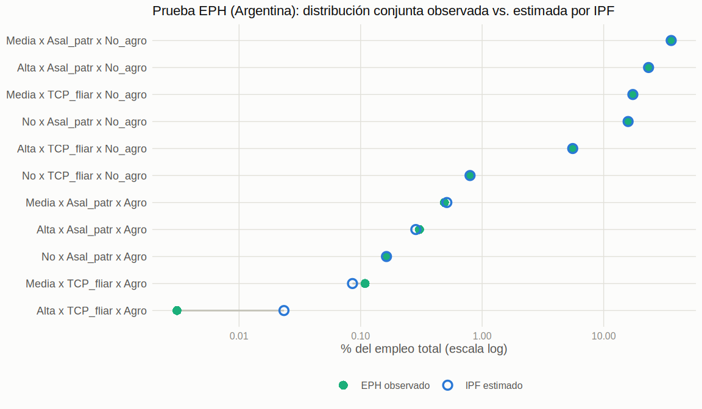
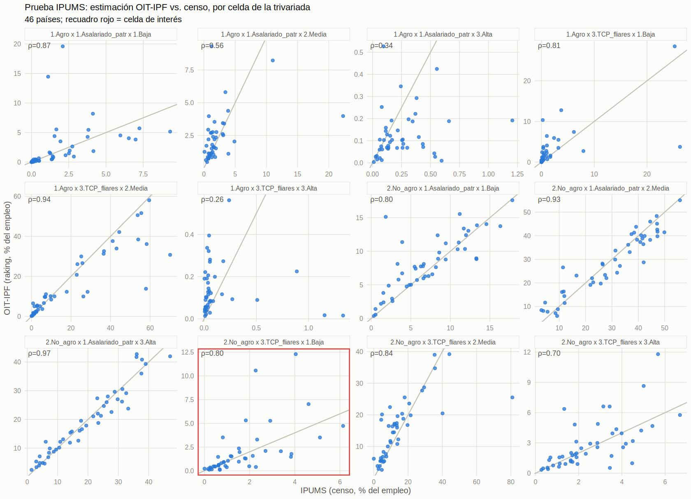
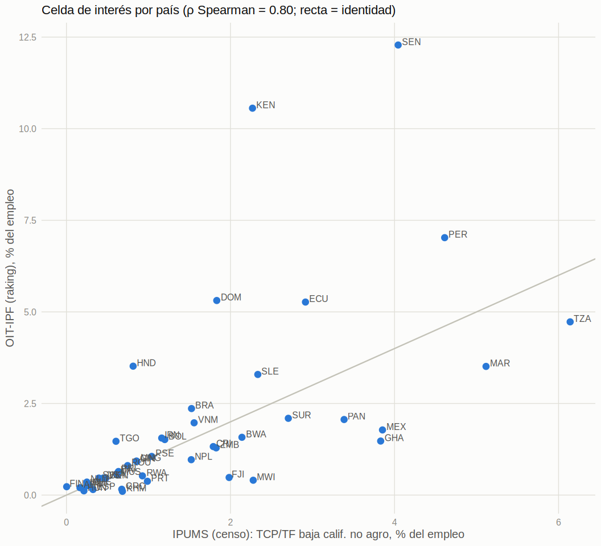
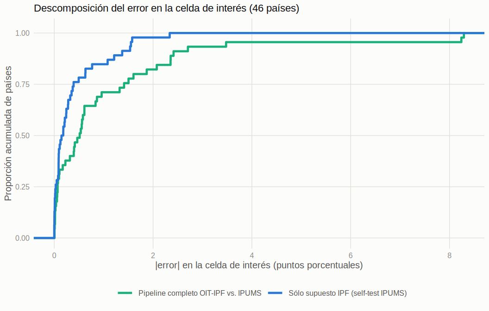

# Informe de resultados — Estimación de TCP/TF de baja calificación no agraria

**Estimación de trabajadores por cuenta propia y familiares (TCP/TF) de baja calificación, no agrícolas, vía
Iterative Proportional Fitting (IPF)**

*Corrida `_v3` — 2026-08-24. Estimación validada: `data/estimacion/20260824_estimacion_tcp_final_v2.csv`
(R, `mipfp::Ipfp`). Scripts: `src/015_analisis_pruebas_ipf.R` (validación) y
`src/014_tcp_estancada_analysis.R` (análisis sustantivo). Este informe consolida los resultados del último
ejercicio de estimación y validación; el detalle metodológico, las corridas intermedias y el historial de
corrección de la estimación quedan documentados en `./reports/parciales/`.*

La celda de interés del proyecto es **TCP/TF de baja calificación, en ramas no agrícolas**, como % del
empleo total: la aproximación estadística que el proyecto usa como piso mínimo de la superpoblación relativa
urbana disfrazada de trabajo por cuenta propia (ver §3).

---

## 0. El método: Iterative Proportional Fitting (IPF)

ILOSTAT no publica una tabla que cruce simultáneamente las tres dimensiones que interesan (calificación de
la ocupación, situación en el empleo y rama de actividad); publica tres tablas **bivariadas** por separado
(calificación × ocupación, calificación × rama, ocupación × rama). El IPF —también llamado *raking*— es el
método que permite reconstruir, a partir de esas tres tablas de a pares, una estimación de la tabla
**trivariada** completa que nunca se observó directamente.

La lógica es un ajuste iterativo: se parte de una distribución inicial uniforme sobre las 12 celdas de la
trivariada (3 calificaciones × 2 situaciones de empleo × 2 ramas) y se la reescala repetidamente, un margen
bivariado a la vez, hasta que las tres proyecciones de la tabla ajustada coinciden con las tres tablas
observadas de ILOSTAT. El resultado es, entre todas las tablas trivariadas compatibles con esos tres
márgenes, la de **máxima entropía**: la más "neutra" posible, que no supone ninguna asociación entre las
tres variables más allá de la que ya está implícita en cada par observado por separado (sin **interacción de
tercer orden**). En R se usa la implementación real del paquete `mipfp` (`Ipfp`); en Python existe una
reimplementación propia (`ipf_utils.py`) usada para validar de forma independiente los resultados de R.

Ese supuesto de "sin interacción de tercer orden" es, a la vez, la fortaleza y el límite del método: permite
estimar lo que no se observa directamente a partir de información parcial, pero si en la realidad existe una
asociación genuina entre las tres variables que no se reduce a la suma de las asociaciones de a pares, el IPF
no puede captarla. La Prueba 1 (§1) valida que el algoritmo reconstruye bien la tabla cuando esa asociación
extra es chica o nula; el self-test dentro de la Prueba 2 (§2.3) mide directamente cuánto pesa esa
limitación en la celda de interés.

### Cómo se agregaron los datos de ILOSTAT

Las tres tablas bivariadas se descargan de la API de ILOSTAT (`Rilostat::get_ilostat`, sexo total, 2009–2019)
en su nivel de desagregación original —niveles de calificación, categorías de situación en el empleo
(ICSE-93) y actividad económica tal como los publica la OIT— y luego se recodifican a las categorías
gruesas del proyecto: calificación (Baja / Media / Alta), situación en el empleo (Asalariado/patrón vs.
TCP/familiares, que agrupa tres categorías ICSE-93 distintas) y rama (Agro vs. No agro, que agrupa las
~5 categorías de actividad económica de ILOSTAT que no son agricultura). Como cada categoría gruesa reúne
varias categorías finas de ILOSTAT, la agregación se hace en dos pasos por país: primero se **suman** las
categorías finas dentro de cada año (para no perder población al recodificar), y recién sobre esos totales
anuales ya sumados se calcula el **promedio entre los años disponibles** en la ventana 2009–2019 —nunca al
revés, porque promediar directo sobre datos todavía desagregados por categoría fina y año subestima
sistemáticamente a las categorías que agrupan más subcomponentes. El resultado son las tres tablas agregadas
por país (`data/estimacion/calif_rama_agg.csv`, `catocup_rama_agg.csv`, `catocup_calif_agg.csv`) que
alimentan el IPF.

La siguiente tabla detalla esa recodificación, categoría fina de ILOSTAT por categoría fina, tal como está
definida en `src/011_preproc_estimacion_tcp_estancada.R`:

| Dimensión | Categoría original ILOSTAT | Categoría agregada del proyecto |
|---|---|---|
| Calificación | `OCU_SKILL_L1` — Skill level 1 (low) | 1.Baja |
| Calificación | `OCU_SKILL_L2` — Skill level 2 (medium) | 2.Media |
| Calificación | `OCU_SKILL_L3-4` — Skill levels 3 y 4 (high) | 3.Alta |
| Calificación | `OCU_SKILL_X` — No clasificado | *(excluida)* |
| Situación en el empleo | `STE_ICSE93_1` — Employees (asalariados) | 1.Asalariado_patr |
| Situación en el empleo | `STE_ICSE93_2` — Employers (empleadores) | 1.Asalariado_patr |
| Situación en el empleo | `STE_ICSE93_3` — Own-account workers (cuenta propia) | 3.TCP_fliares |
| Situación en el empleo | `STE_ICSE93_4` — Members of producers' cooperatives | 3.TCP_fliares |
| Situación en el empleo | `STE_ICSE93_5` — Contributing family workers (familiares) | 3.TCP_fliares |
| Situación en el empleo | `STE_ICSE93_6` — No clasificable por situación | *(excluida)* |
| Rama de actividad | `ECO_AGGREGATE_AGR` — Agriculture | 1.Agro |
| Rama de actividad | `ECO_AGGREGATE_CON` — Construction | 2.No_agro |
| Rama de actividad | `ECO_AGGREGATE_MAN` — Manufacturing | 2.No_agro |
| Rama de actividad | `ECO_AGGREGATE_MEL` — Mining and quarrying; Electricity, gas and water supply | 2.No_agro |
| Rama de actividad | `ECO_AGGREGATE_MKT` — Trade, Transportation, Accommodation and Food, and Business and Administrative Services | 2.No_agro |
| Rama de actividad | `ECO_AGGREGATE_PUB` — Public Administration, Community, Social and other Services | 2.No_agro |
| Rama de actividad | `ECO_AGGREGATE_X` — No clasificado | *(excluida)* |

Rama es la dimensión con más categorías finas agrupadas (5 → "No agro"), lo que explica por qué el orden
suma-primero-promedia-después es más sensible ahí que en las otras dos dimensiones: es donde más población
se pierde si se promedia antes de sumar.

### Períodos de referencia de los datos

| Fuente | Cobertura temporal | Notas |
|---|---|---|
| ILOSTAT (`calif_rama`, `catocup_rama`, `catocup_calif`) | **2009–2019** | Ventana agregada de las tres tablas bivariadas (confirmado sobre `data/raw_data/`). Varía por país: de los 175 países con datos, 33 aportan un único año puntual, 63 tienen el panel completo de 11 años, y el resto valores intermedios. `011` promedia, por país, los años disponibles dentro de esa ventana — no todos los países están medidos en el mismo momento. |
| IPUMS International (censos) | **No disponible en el extracto vigente** | Cada país aporta una muestra censal puntual, pero el año censal **no se conserva** en `data/ipums_ifp_v2_tcp_by_calif.csv` (limitación ya documentada en `reports/parciales/analisis_pruebas_ipf.md`; pendiente recuperarlo desde la extracción original de IPUMS, `102_tcp_by_calif.R`, que sí agrupa por `YEAR` en un paso intermedio no conservado en el CSV final). |

Esto importa para leer §1 y §2: parte de la discrepancia entre la estimación OIT-IPF (promedio 2009–2019) y
el patrón IPUMS puede deberse a desfase temporal —cada censo IPUMS es un corte puntual, no necesariamente
dentro de esa ventana— y no solo a desacuerdo de fuente o a la limitación de método discutida en §2.3. No es
posible, con los datos actualmente en el repo, separar cuánto de la discrepancia por país corresponde a cada
uno de esos tres factores.

---

## 1. Comparación con EPH (Argentina)

Se reconstruyeron a partir de la Encuesta Permanente de Hogares (EPH) las tres tablas bivariadas que
alimentan el IPF (calificación × ocupación, calificación × rama, ocupación × rama) y se compararon los
resultados del IPF contra la distribución conjunta observada **directamente** en la encuesta — es decir, se
usó el mismo país, la misma fuente y el mismo período tanto para los márgenes de entrada como para el
patrón de comparación.

| Celda | % observado (EPH) | % estimado (IPF) | Error (pp) |
|---|---:|---:|---:|
| Alta × Asal_patr × Agro | 0,305 | 0,285 | −0,020 |
| Alta × Asal_patr × No_agro | 23,378 | 23,398 | +0,020 |
| Alta × TCP_fliar × Agro | 0,031 | 0,234 | +0,020 |
| Alta × TCP_fliar × No_agro | 5,580 | 5,560 | −0,020 |
| Media × Asal_patr × Agro | 0,489 | 0,512 | +0,023 |
| Media × Asal_patr × No_agro | 35,944 | 35,921 | −0,023 |
| Media × TCP_fliar × Agro | 0,109 | 0,086 | −0,023 |
| Media × TCP_fliar × No_agro | 17,351 | 17,374 | +0,023 |
| No calif. × Asal_patr × Agro | 0,166 | 0,163 | −0,003 |
| No calif. × Asal_patr × No_agro | 15,878 | 15,880 | +0,003 |
| No calif. × TCP_fliar × No_agro | 0,798 | 0,795 | −0,003 |

- **MAE ponderado:** 0,017 pp | **error máximo:** 0,023 pp
- **Índice de disimilitud** (0,5 × Σ|diferencias|): 0,091 pp
- **Correlación de Pearson** observado vs. estimado: 0,999999

### Implicancias

Esta prueba aísla la fidelidad del **método** en su mejor escenario posible: márgenes de entrada consistentes
entre sí porque vienen de la misma encuesta. El resultado (error máximo de 0,023 pp sobre celdas que van de
0,03% a 35% del empleo) muestra que el IPF **no introduce distorsión apreciable** cuando los insumos son
coherentes — reproduce la distribución conjunta observada casi exactamente. Esto es lo que permite, más
adelante, atribuir con confianza el error de la Prueba IPUMS (§2) a los insumos o a la interacción de tercer
orden del método (§2.3), y no a un problema de implementación del algoritmo: la EPH es el control de que "el
método funciona" cuando las condiciones son ideales.

---

## 2. Comparación con IPUMS (47 países)

Se comparó la estimación IPF —basada en tablas bivariadas de la OIT/ILOSTAT, para 159 países— contra las
muestras censales de IPUMS International, en 47 países. De ellos, 46 tienen estimación IPF disponible (falta
Canadá, fuera de la intersección de países de ILOSTAT).

- **Celdas comparadas:** 541
- **Correlación global:** Pearson 0,928 | Spearman 0,933
- **Error absoluto medio (MAE):** 2,15 pp | **mediana del error absoluto:** 0,66 pp

### 2.1 Métricas por celda de la trivariada

| Rama | Ocupación | Calificación | n países | Pearson | Spearman | MAE (pp) | Sesgo (pp) |
|---|---|---|---:|---:|---:|---:|---:|
| Agro | Asalariado/patrón | Baja | 45 | 0,397 | 0,873 | 1,57 | +0,52 |
| Agro | Asalariado/patrón | Media | 45 | 0,406 | 0,557 | 1,38 | +0,03 |
| Agro | Asalariado/patrón | Alta | 45 | 0,202 | 0,335 | 0,16 | −0,12 |
| Agro | TCP/familiares | Baja | 42 | 0,653 | 0,805 | 2,09 | +0,73 |
| Agro | TCP/familiares | Media | 45 | 0,891 | 0,942 | 5,23 | −3,65 |
| Agro | TCP/familiares | Alta | 44 | −0,083 | 0,261 | 0,17 | +0,00 |
| No agro | Asalariado/patrón | Baja | 46 | 0,798 | 0,802 | 1,77 | +0,95 |
| No agro | Asalariado/patrón | Media | 46 | 0,946 | 0,929 | 3,97 | −0,86 |
| No agro | Asalariado/patrón | Alta | 46 | 0,967 | 0,971 | 2,23 | −0,22 |
| **No agro** | **TCP/familiares** | **Baja** | **45** | **0,605** | **0,798** | **1,10** | **+0,32** |
| No agro | TCP/familiares | Media | 46 | 0,726 | 0,841 | 4,91 | +0,76 |
| No agro | TCP/familiares | Alta | 46 | 0,658 | 0,699 | 1,13 | +0,28 |

La fila resaltada es la **celda de interés** del proyecto.

### 2.2 Celda de interés, país por país

Sobre 45 países con dato en ambas fuentes: **Pearson 0,605 | Spearman 0,798 | MAE 1,10 pp | sesgo +0,32 pp**.

Los mayores desacuerdos absolutos (estimación IPF menos IPUMS, en pp):

| País | IPF (%) | IPUMS (%) | Diferencia (pp) |
|---|---:|---:|---:|
| KEN | 10,56 | 2,27 | +8,29 |
| SEN | 12,28 | 4,04 | +8,24 |
| DOM | 5,31 | 1,83 | +3,48 |
| HND | 3,52 | 0,81 | +2,71 |
| PER | 7,03 | 4,61 | +2,41 |
| ECU | 5,27 | 2,91 | +2,35 |
| GHA | 1,47 | 3,83 | −2,36 |
| MEX | 1,78 | 3,85 | −2,08 |

Excluyendo los dos mayores outliers (Senegal y Kenia, donde las encuestas de fuerza de trabajo de la OIT y
los censos difieren fuertemente en el nivel general de baja calificación: 26% vs. 9% y 35% vs. 16%
respectivamente), la celda de interés queda con **MAE 0,76 pp y sesgo −0,05 pp sobre 43 países**.

### 2.3 Descomponiendo el error: self-test del método IPF

Para separar cuánto del error de 2.2 viene de los **insumos** (OIT vs. censo) y cuánto del **método** (el
supuesto de máxima entropía / no-interacción de tercer orden del IPF), se corrió un experimento adicional:
se tomó la distribución conjunta *verdadera* de cada país según IPUMS, se generaron sus tres márgenes
bivariados (perfectamente consistentes entre sí, porque vienen de la misma tabla), y se corrió el IPF sobre
esos márgenes para reconstruir la trivariada. Cualquier diferencia entre la trivariada reconstruida y la
verdadera solo puede deberse al método, no a desacuerdo de fuentes.

- **MAE global:** 0,31 pp | **percentil 90 del error absoluto:** 1,05 pp | **máximo:** 2,37 pp
- **Celda de interés:** MAE 0,38 pp | **sesgo −0,33 pp** | Spearman 0,90

### 2.4 Consistencia del margen TCP/TF × No agro entre tres fuentes

Como chequeo adicional, se comparó el margen "TCP/familiares × No agro" calculado de tres formas
independientes: (a) agregando la trivariada estimada por IPF, (b) el cálculo directo de ese margen a partir
de las tablas bivariadas OIT (sin pasar por el IPF), y (c) el valor observado en IPUMS, sobre 46 países.

| Comparación | MAE (pp) | Pearson | Spearman |
|---|---:|---:|---:|
| IPF vs. IPUMS | 5,67 | 0,716 | 0,827 |
| Cálculo directo (OIT) vs. IPUMS | 5,66 | 0,718 | 0,844 |

Los dos caminos de estimación (vía IPF y cálculo directo) coinciden entre sí de forma prácticamente
perfecta, y ambos se apartan de IPUMS en magnitudes y direcciones similares.

### Implicancias

Tres lecturas se desprenden de esta prueba, en conjunto:

1. **La estimación converge razonablemente con una fuente externa independiente** (Spearman 0,80 en la celda
   de interés, sobre 45 países), con un sesgo pequeño y sin evidencia de distorsión sistemática grande.
2. **Los dos mayores desacuerdos (Senegal, Kenia) son de fuente, no del pipeline.** El self-test (2.3)
   muestra que el método, aplicado a la verdad censal misma, produce un error chico (MAE 0,38 pp); la
   distancia real en esos dos países (+8 pp) solo puede explicarse porque la encuesta de fuerza de trabajo
   de la OIT y el censo miden magnitudes distintas de baja calificación general en esos países. §2.4 refuerza
   esto: el desacuerdo con IPUMS es el mismo tanto si se llega al margen vía IPF como si se lo calcula
   directamente de las tablas OIT sin pasar por el algoritmo — el punto de fricción está antes del IPF.
3. **El método tiene un sesgo estructural de subestimación, pequeño pero sistemático** (−0,33 pp en el
   self-test de la celda de interés): incluso con márgenes de entrada perfectos, el supuesto de máxima
   entropía no captura una interacción de tercer orden real presente en los datos (dentro del sector no
   agrícola, ser TCP/TF está más asociado a la baja calificación de lo que predicen los márgenes bivariados
   por separado). **La estimación final debe leerse, en consecuencia, como un piso razonable de la magnitud
   real**, no como una medida sin sesgo.

---

## 3. Resultados sustantivos: cluster PIMSA, ingreso y región

*Fuente: `data/estimacion/tabla_tcps_final_sums.csv` (181 países). Valores: medias ponderadas por
`prop_ocup_totales`.*

### Por cluster PIMSA

| Cluster | TCP/TF totales | TCP/TF calif. baja | TCP/TF no agro | **TCP/TF no agro calif. baja** |
|---|---:|---:|---:|---:|
| C1. Cap. avanzado | 9,5% | 0,7% | 8,2% | **0,6%** |
| C2. Cap. extensión reciente c/desarrollo profundidad | 28,3% | 3,6% | 21,6% | **2,1%** |
| C3. Cap. extensión c/peso campo | 43,0% | 5,2% | 21,5% | **1,9%** |
| C4. Cap. escasa extensión c/peso campo | 70,2% | 17,8% | 29,4% | **6,2%** |
| C5. Pequeña propiedad en el campo | 79,3% | 11,7% | 19,0% | **3,1%** |

Gradiente claro y monótono entre C1 y C4: a menor desarrollo de las capacidades productivas, mayor peso del
TCP/TF total y de su fracción de baja calificación no agro (0,6% → 6,2%, 10x entre extremos). C5 rompe la
monotonía porque su alto TCP/TF total es sobre todo agrícola (fuera de la celda de interés).

### Por grupo de ingreso

| Grupo | TCP/TF calif. baja | TCP/TF no agro | **TCP/TF no agro calif. baja** |
|---|---:|---:|---:|
| 01 Altos ingresos | 1,0% | 10,0% | **0,8%** |
| 02 Medios-altos ingresos | 3,8% | 16,9% | **1,8%** |
| 03 Medios-bajos ingresos | 14,3% | 27,2% | **5,0%** |
| 04 Bajos ingresos | 11,6% | 20,6% | **3,2%** |

Relación no lineal: el pico está en ingreso medio-bajo (5,0%), no en el más pobre (3,2%) — coherente con el
patrón por cluster (C4 > C5).

### Por región

| Región | TCP/TF calif. baja | TCP/TF no agro | **TCP/TF no agro calif. baja** |
|---|---:|---:|---:|
| South Asia | 18,4% | 30,4% | **7,1%** |
| Sub-Saharan Africa | 10,6% | 22,2% | **3,8%** |
| Latin America & Caribbean | 5,2% | 23,6% | **2,6%** |
| East Asia & Pacific | 7,3% | 19,3% | **1,6%** |
| Middle East & North Africa | 3,2% | 17,1% | **1,7%** |
| Europe & Central Asia | 1,0% | 9,6% | **0,3%** |
| North America | 0,5% | 6,0% | **0,5%** |

South Asia y Sub-Saharan Africa concentran los valores más altos; Europa/Asia Central y Norteamérica los más
bajos.

### Lectura teórica: TCP/TF de baja calificación no agraria como superpoblación estancada

El indicador es, por diseño, un **piso mínimo** de la superpoblación relativa urbana disfrazada de trabajo
por cuenta propia: se restringe a las "ocupaciones elementales" (grupo 9 de la CIUO-08) para no forzar la
hipótesis, dejando afuera —indiscriminada en la calificación media— a buena parte de la capa que también
podría leerse como proletaria (talleristas, choferes, comerciantes menores, repartidores en moto, etc.).

Marx caracteriza a la superpoblación **estancada** por una ocupación "sumamente irregular", condiciones de
vida "por debajo del nivel medio normal de la clase obrera" y una disposición a aceptar el "máximo de tiempo
de trabajo" por el "mínimo de salario" —rasgos que la hacen, a la vez, "campo de reclutamiento" inagotable
para el capital y depósito de una población que éste ya no necesita regularizar. A diferencia de la
superpoblación **flotante** (la que rota dentro y fuera del empleo asalariado regular en los propios centros
de la gran industria) y de la **latente** (la que la penetración capitalista todavía no termina de expulsar
del campo, manteniéndola dentro de la agricultura como fuerza de trabajo virtualmente disponible), la
estancada es precisamente la que ya fue separada de sus medios de vida agrarios pero **no** fue absorbida
por el trabajo asalariado regular: queda flotando en los intersticios urbanos y semi-urbanos, y el
"cuentapropismo" de baja calificación —el cartonero, el repartidor, el vendedor ambulante, el changarín— es
una de sus formas fenoménicas más visibles, aunque estadísticamente quede emplastada bajo la misma categoría
que el pequeño propietario exitoso.

Leído así, el gradiente por cluster PIMSA (C1→C4: 0,6% → 6,2%) es un gradiente en la **capacidad del capital
para absorber, en trabajo asalariado regular, a la población que su propia extensión separa de los medios de
vida agrarios**. Cuanto menor esa capacidad relativa de absorción (C4: "extensión escasa"), mayor la fracción
de esa población que queda flotando como estancada en circuitos urbanos no agrarios de baja calificación, en
vez de ser regularizada como asalariada. C5 rompe la monotonía porque ahí la separación respecto de los
medios de vida agrarios todavía no se completó: la superpoblación sigue estando, predominantemente, en su
forma **latente** (retenida dentro del campo) más que en su forma estancada no agraria.

La misma lógica explica el pico no monótono por ingreso (medio-bajo, no el más pobre) y la concentración
regional en South Asia y Sub-Saharan Africa: son las zonas donde el proceso de expulsión agraria ya avanzó lo
suficiente como para generar una masa urbana considerable, pero donde la industrialización y el empleo
asalariado formal no crecieron al mismo ritmo para absorberla. En los países de ingreso más bajo, esa masa
todavía tiende a estar retenida como superpoblación latente dentro del propio campo; en los países de
ingreso alto, la capacidad de absorción asalariada reduce la celda casi a cero. El patrón es compatible con
leer al TCP/TF de baja calificación no agraria no como una capa de pequeños empresarios en potencia, sino
como una expresión estadística —parcial y necesariamente subestimada, por la restricción a ocupaciones
elementales y por el sesgo de método documentado en §2.3— de la superpoblación relativa estancada.

---

## Síntesis general

- **EPH**: el método reproduce con altísima fidelidad la distribución conjunta cuando los márgenes de
  entrada son consistentes (error máximo 0,02 pp) — confirma que el IPF, como técnica, no introduce
  distorsión propia apreciable.
- **IPUMS**: contra un patrón externo independiente, la celda de interés muestra correlación moderada-alta
  (Spearman 0,80) y sesgo pequeño (+0,32 pp), con los mayores desacuerdos atribuibles a discrepancias de
  fuente (OIT vs. censo) en dos países puntuales, no al pipeline. El self-test aísla un sesgo estructural
  de subestimación (−0,33 pp): la estimación final debe leerse como un piso.
- **Sustantivo**: el gradiente por cluster, ingreso y región es consistente con la hipótesis de que el
  TCP/TF de baja calificación no agraria funciona como expresión estadística de la superpoblación relativa
  **estancada** — concentrada donde la separación respecto de los medios de vida agrarios ya avanzó pero la
  absorción asalariada regular no la siguió al mismo ritmo.
