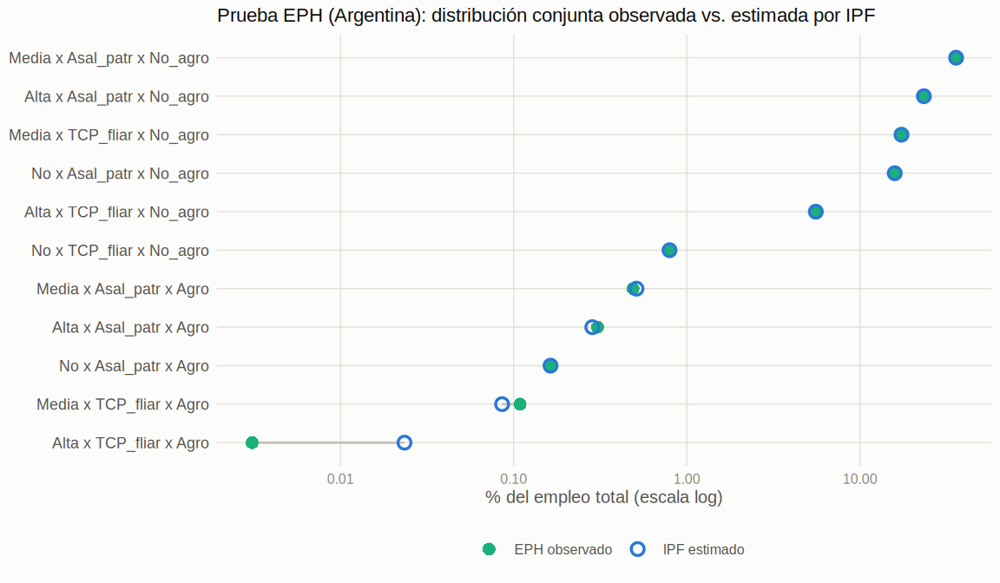
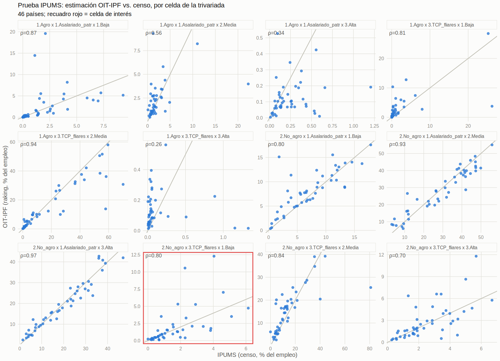
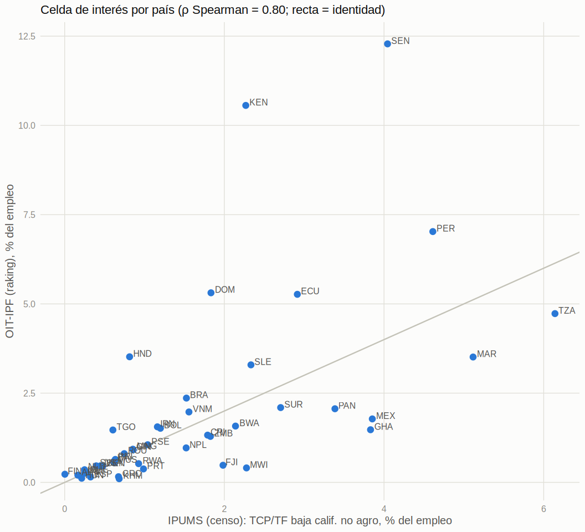
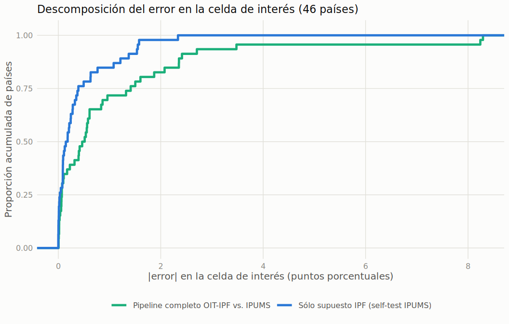
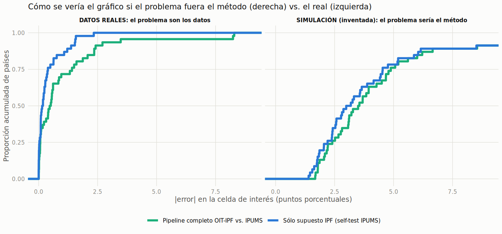
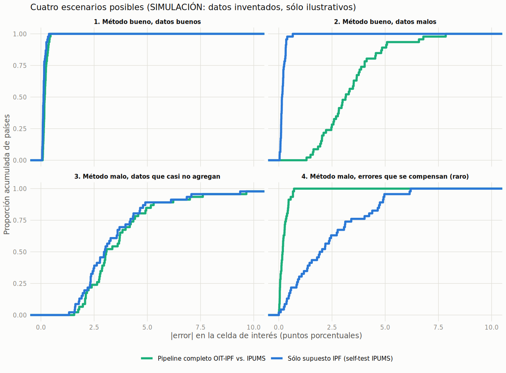
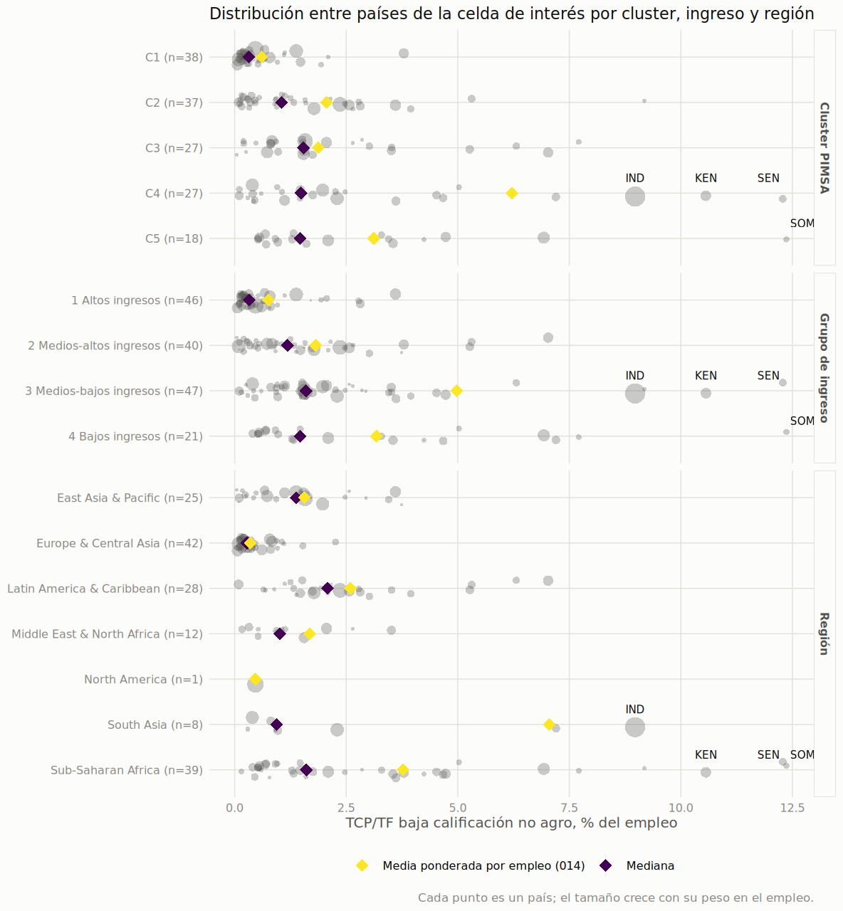
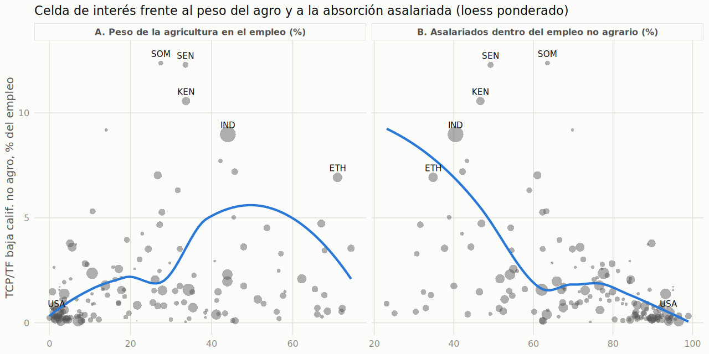

# Informe de resultados — Estimación de TCP/TF de baja calificación no agraria

**Estimación de trabajadores por cuenta propia y familiares (TCP/TF) de baja calificación, no agrícolas, vía
Iterative Proportional Fitting (IPF)**

*Corrida `_v3` — 2026-08-24. Estimación validada: `data/estimacion/20260824_estimacion_tcp_final_v2.csv`
(R, `mipfp::Ipfp`). Scripts: `src/015_analisis_pruebas_ipf.R` (validación) y
`src/014_tcp_estancada_analysis.R` (análisis sustantivo). Este informe consolida los resultados del último
ejercicio de estimación y validación; el detalle metodológico, las corridas intermedias y el historial de
corrección de la estimación quedan documentados en `./reports/parciales/`.*

La celda de interés del proyecto es **TCP/TF de baja calificación, en ramas no agrícolas**, como % del
empleo total: la aproximación estadística que el proyecto usa como piso mínimo de la superpoblación relativa
urbana disfrazada de trabajo por cuenta propia (ver §3).

---

## Cómo leer las medidas de error

Casi todas las comparaciones de este informe miden qué tan lejos queda una estimación de una referencia. Para cada
país y cada celda se define el **error con signo**, `err = estimado − referencia`: negativo si la estimación queda por
debajo de la referencia, positivo si queda por encima. Salvo que se indique otra cosa, los errores se expresan en
**puntos porcentuales (pp) del empleo total del país**.

**Las medidas**

- **MAE (error absoluto medio):** el promedio de `|err|`. Mide *cuánto* se equivoca la estimación, sin importar en qué
  dirección: un +1 y un −1 cuentan igual y no se compensan.
- **Mediana del error absoluto:** el error del caso típico. Si es mucho menor que el MAE, unos pocos casos grandes
  arrastran el promedio. El **percentil 90** y el **máximo** describen esa cola.
- **Sesgo:** el promedio de `err`, con su signo. Mide *hacia dónde* se equivoca la estimación en promedio. Un sesgo
  distinto de 0 es un error sistemático, que va casi siempre en la misma dirección. Su valor absoluto nunca supera el
  MAE, y lo iguala solo si todos los errores tienen el mismo signo. Un sesgo cercano a 0 no implica error chico (puede
  haber compensación entre países), ni un MAE chico implica ausencia de sesgo.
- **Pearson y Spearman:** miden la *concordancia* entre estimado y referencia, no el tamaño del error. Pearson captura
  la relación lineal (y es sensible a los valores extremos); Spearman, el orden entre países. Una estimación puede
  correlacionar muy bien y estar sistemáticamente desplazada, o al revés.
- **Error relativo:** el error dividido por el valor de la celda. El mismo error en pp pesa mucho más en una celda de
  1 % que en una de 30 %.

**Qué mide cada comparación.** Las mismas medidas tienen distinto significado según qué se compare con qué:

| Comparación | Estimado | Referencia | Qué error mide | Medidas que se reportan |
|---|---|---|---|---|
| EPH (§1) | IPF sobre tablas bivariadas reconstruidas de la EPH | Trivariada observada en la EPH (mismo país, fuente y período) | Solo el error del **método**, con insumos consistentes y un país | MAE ponderado, error máximo, índice de disimilitud, Pearson |
| IPUMS vs. estimación (§2.1–2.2) | IPF con tablas de la OIT | Trivariada observada en IPUMS | Error **total**: método más fuente (OIT vs. censo, definiciones, año) | Pearson, Spearman, MAE, mediana, sesgo, por celda y por país |
| Self-test (§2.3) | IPF sobre los márgenes de IPUMS | Trivariada de IPUMS | Solo el error del **método**, en el mejor escenario (insumos perfectos) | MAE, sesgo, mediana, percentil 90, máximo, por celda |
| Consistencia del margen (§2.4) | Margen TCP/TF × No agro por IPF o por cálculo directo de la OIT | Margen observado en IPUMS | Error de **fuente** en un margen, y si el IPF reproduce su insumo | MAE, Pearson, Spearman |
| Descomposición (§2.5) | IPF con piezas de la OIT reemplazadas por las de IPUMS, o con distintos años | IPUMS | **De dónde viene** el error de fuente | Reducción del MAE por pieza (Shapley), MAE por escalón, rango de la celda entre años |
| Resultados sustantivos (§3) | — | — | **No son medidas de error**: describen niveles (% del empleo) | Medias ponderadas por empleo, medianas, rango intercuartil |

**Una advertencia sobre las bases de países.** Las secciones no usan exactamente los mismos países. §2.1 y §2.2
trabajan con las celdas presentes en el archivo de comparación con IPUMS (45 países en la celda de interés): ese cruce
descarta a Francia, donde IPUMS no tiene casos en la celda y la verdad es 0. §2.3 y §2.5 usan los 46 países, con verdad
0 donde corresponde. Por eso el MAE de la celda de interés es 1,10 pp en §2.2 y 1,07 pp en §2.3 y §2.5.

---

## 0. El método: Iterative Proportional Fitting (IPF)

ILOSTAT no publica una tabla que cruce simultáneamente las tres dimensiones que interesan (calificación de
la ocupación, situación en el empleo y rama de actividad); publica tres tablas **bivariadas** por separado
(calificación × ocupación, calificación × rama, ocupación × rama). El IPF —también llamado *raking*— es el
método que permite reconstruir, a partir de esas tres tablas de a pares, una estimación de la tabla
**trivariada** completa que nunca se observó directamente.

La lógica es un ajuste iterativo: se parte de una distribución inicial uniforme sobre las 12 celdas de la
trivariada (3 calificaciones × 2 situaciones de empleo × 2 ramas) y se la reescala repetidamente, un margen
bivariado a la vez, hasta que las tres proyecciones de la tabla ajustada coinciden con las tres tablas
observadas de ILOSTAT. El resultado es, entre todas las tablas trivariadas compatibles con esos tres
márgenes, la de **máxima entropía**: la más "neutra" posible, que no supone ninguna asociación entre las
tres variables más allá de la que ya está implícita en cada par observado por separado (sin **interacción de
tercer orden**). En R se usa la implementación real del paquete `mipfp` (`Ipfp`); en Python existe una
reimplementación propia (`ipf_utils.py`) usada para validar de forma independiente los resultados de R.

Ese supuesto de "sin interacción de tercer orden" es, a la vez, la fortaleza y el límite del método: permite
estimar lo que no se observa directamente a partir de información parcial, pero si en la realidad existe una
asociación genuina entre las tres variables que no se reduce a la suma de las asociaciones de a pares, el IPF
no puede captarla. La Prueba 1 (§1) valida que el algoritmo reconstruye bien la tabla cuando esa asociación
extra es chica o nula; el self-test dentro de la Prueba 2 (§2.3) mide directamente cuánto pesa esa
limitación en la celda de interés.

### Cómo se agregaron los datos de ILOSTAT

Las tres tablas bivariadas se descargan de la API de ILOSTAT (`Rilostat::get_ilostat`, sexo total, 2009–2019)
en su nivel de desagregación original —niveles de calificación, categorías de situación en el empleo
(ICSE-93) y actividad económica tal como los publica la OIT— y luego se recodifican a las categorías
gruesas del proyecto: calificación (Baja / Media / Alta), situación en el empleo (Asalariado/patrón vs.
TCP/familiares, que agrupa tres categorías ICSE-93 distintas) y rama (Agro vs. No agro, que agrupa las
~5 categorías de actividad económica de ILOSTAT que no son agricultura). Como cada categoría gruesa reúne
varias categorías finas de ILOSTAT, la agregación se hace en dos pasos por país: primero se **suman** las
categorías finas dentro de cada año (para no perder población al recodificar), y recién sobre esos totales
anuales ya sumados se calcula el **promedio entre los años disponibles** en la ventana 2009–2019 —nunca al
revés, porque promediar directo sobre datos todavía desagregados por categoría fina y año subestima
sistemáticamente a las categorías que agrupan más subcomponentes. El resultado son las tres tablas agregadas
por país (`data/estimacion/calif_rama_agg.csv`, `catocup_rama_agg.csv`, `catocup_calif_agg.csv`) que
alimentan el IPF.

La siguiente tabla detalla esa recodificación, categoría fina de ILOSTAT por categoría fina, tal como está
definida en `src/011_preproc_estimacion_tcp_estancada.R`:

| Dimensión | Categoría original ILOSTAT | Categoría agregada del proyecto |
|---|---|---|
| Calificación | `OCU_SKILL_L1` — Skill level 1 (low) | 1.Baja |
| Calificación | `OCU_SKILL_L2` — Skill level 2 (medium) | 2.Media |
| Calificación | `OCU_SKILL_L3-4` — Skill levels 3 y 4 (high) | 3.Alta |
| Calificación | `OCU_SKILL_X` — No clasificado | *(excluida)* |
| Situación en el empleo | `STE_ICSE93_1` — Employees (asalariados) | 1.Asalariado_patr |
| Situación en el empleo | `STE_ICSE93_2` — Employers (empleadores) | 1.Asalariado_patr |
| Situación en el empleo | `STE_ICSE93_3` — Own-account workers (cuenta propia) | 3.TCP_fliares |
| Situación en el empleo | `STE_ICSE93_4` — Members of producers' cooperatives | 3.TCP_fliares |
| Situación en el empleo | `STE_ICSE93_5` — Contributing family workers (familiares) | 3.TCP_fliares |
| Situación en el empleo | `STE_ICSE93_6` — No clasificable por situación | *(excluida)* |
| Rama de actividad | `ECO_AGGREGATE_AGR` — Agriculture | 1.Agro |
| Rama de actividad | `ECO_AGGREGATE_CON` — Construction | 2.No_agro |
| Rama de actividad | `ECO_AGGREGATE_MAN` — Manufacturing | 2.No_agro |
| Rama de actividad | `ECO_AGGREGATE_MEL` — Mining and quarrying; Electricity, gas and water supply | 2.No_agro |
| Rama de actividad | `ECO_AGGREGATE_MKT` — Trade, Transportation, Accommodation and Food, and Business and Administrative Services | 2.No_agro |
| Rama de actividad | `ECO_AGGREGATE_PUB` — Public Administration, Community, Social and other Services | 2.No_agro |
| Rama de actividad | `ECO_AGGREGATE_X` — No clasificado | *(excluida)* |

Rama es la dimensión con más categorías finas agrupadas (5 → "No agro"), lo que explica por qué el orden
suma-primero-promedia-después es más sensible ahí que en las otras dos dimensiones: es donde más población
se pierde si se promedia antes de sumar.

### Períodos de referencia de los datos

| Fuente | Cobertura temporal | Notas |
|---|---|---|
| ILOSTAT (`calif_rama`, `catocup_rama`, `catocup_calif`) | **2009–2019** | Ventana agregada de las tres tablas bivariadas (confirmado sobre `data/raw_data/`). Varía por país: de los 175 países con datos, 33 aportan un único año puntual, 63 tienen el panel completo de 11 años, y el resto valores intermedios. `011` promedia, por país, los años disponibles dentro de esa ventana — no todos los países están medidos en el mismo momento. |
| IPUMS International (censos) | **No disponible en el extracto vigente** | Cada país aporta una muestra censal puntual, pero el año censal **no se conserva** en `data/ipums_ifp_v2_tcp_by_calif.csv` (limitación ya documentada en `reports/parciales/analisis_pruebas_ipf.md`; pendiente recuperarlo desde la extracción original de IPUMS, `102_tcp_by_calif.R`, que sí agrupa por `YEAR` en un paso intermedio no conservado en el CSV final). |

Esto importa para leer §1 y §2: parte de la discrepancia entre la estimación OIT-IPF (promedio 2009–2019) y
el patrón IPUMS puede deberse a desfase temporal —cada censo IPUMS es un corte puntual, no necesariamente
dentro de esa ventana— y no solo a desacuerdo de fuente o a la limitación de método discutida en §2.3. No es
posible, con los datos actualmente en el repo, separar cuánto de la discrepancia por país corresponde a cada
uno de esos tres factores.

---

## 1. Comparación con EPH (Argentina)

Se reconstruyeron a partir de la Encuesta Permanente de Hogares (EPH) las tres tablas bivariadas que
alimentan el IPF (calificación × ocupación, calificación × rama, ocupación × rama) y se compararon los
resultados del IPF contra la distribución conjunta observada **directamente** en la encuesta — es decir, se
usó el mismo país, la misma fuente y el mismo período tanto para los márgenes de entrada como para el
patrón de comparación.

| Celda | % observado (EPH) | % estimado (IPF) | Error (pp) |
|---|---:|---:|---:|
| Alta × Asal_patr × Agro | 0,305 | 0,285 | −0,020 |
| Alta × Asal_patr × No_agro | 23,378 | 23,398 | +0,020 |
| Alta × TCP_fliar × Agro | 0,031 | 0,234 | +0,020 |
| Alta × TCP_fliar × No_agro | 5,580 | 5,560 | −0,020 |
| Media × Asal_patr × Agro | 0,489 | 0,512 | +0,023 |
| Media × Asal_patr × No_agro | 35,944 | 35,921 | −0,023 |
| Media × TCP_fliar × Agro | 0,109 | 0,086 | −0,023 |
| Media × TCP_fliar × No_agro | 17,351 | 17,374 | +0,023 |
| No calif. × Asal_patr × Agro | 0,166 | 0,163 | −0,003 |
| No calif. × Asal_patr × No_agro | 15,878 | 15,880 | +0,003 |
| No calif. × TCP_fliar × No_agro | 0,798 | 0,795 | −0,003 |

- **MAE ponderado:** 0,017 pp | **error máximo:** 0,023 pp
- **Índice de disimilitud** (0,5 × Σ|diferencias|): 0,091 pp
- **Correlación de Pearson** observado vs. estimado: 0,999999

### Implicancias

Esta prueba aísla la fidelidad del **método** en su mejor escenario posible: márgenes de entrada consistentes
entre sí porque vienen de la misma encuesta. El resultado (error máximo de 0,023 pp sobre celdas que van de
0,03% a 35% del empleo) muestra que el IPF **no introduce distorsión apreciable** cuando los insumos son
coherentes — reproduce la distribución conjunta observada casi exactamente. Esto es lo que permite, más
adelante, atribuir con confianza el error de la Prueba IPUMS (§2) a los insumos o a la interacción de tercer
orden del método (§2.3), y no a un problema de implementación del algoritmo: la EPH es el control de que "el
método funciona" cuando las condiciones son ideales.

---

## 2. Comparación con IPUMS (47 países)

Se comparó la estimación IPF —basada en tablas bivariadas de la OIT/ILOSTAT, para 159 países— contra las
muestras censales de IPUMS International, en 47 países. De ellos, 46 tienen estimación IPF disponible (falta
Canadá, fuera de la intersección de países de ILOSTAT).

- **Celdas comparadas:** 541
- **Correlación global:** Pearson 0,928 | Spearman 0,933
- **Error absoluto medio (MAE):** 2,15 pp | **mediana del error absoluto:** 0,66 pp

### 2.1 Métricas por celda de la trivariada

| Rama | Ocupación | Calificación | n países | Pearson | Spearman | MAE (pp) | Sesgo (pp) |
|---|---|---|---:|---:|---:|---:|---:|
| Agro | Asalariado/patrón | Baja | 45 | 0,397 | 0,873 | 1,57 | +0,52 |
| Agro | Asalariado/patrón | Media | 45 | 0,406 | 0,557 | 1,38 | +0,03 |
| Agro | Asalariado/patrón | Alta | 45 | 0,202 | 0,335 | 0,16 | −0,12 |
| Agro | TCP/familiares | Baja | 42 | 0,653 | 0,805 | 2,09 | +0,73 |
| Agro | TCP/familiares | Media | 45 | 0,891 | 0,942 | 5,23 | −3,65 |
| Agro | TCP/familiares | Alta | 44 | −0,083 | 0,261 | 0,17 | +0,00 |
| No agro | Asalariado/patrón | Baja | 46 | 0,798 | 0,802 | 1,77 | +0,95 |
| No agro | Asalariado/patrón | Media | 46 | 0,946 | 0,929 | 3,97 | −0,86 |
| No agro | Asalariado/patrón | Alta | 46 | 0,967 | 0,971 | 2,23 | −0,22 |
| **No agro** | **TCP/familiares** | **Baja** | **45** | **0,605** | **0,798** | **1,10** | **+0,32** |
| No agro | TCP/familiares | Media | 46 | 0,726 | 0,841 | 4,91 | +0,76 |
| No agro | TCP/familiares | Alta | 46 | 0,658 | 0,699 | 1,13 | +0,28 |

La fila resaltada es la **celda de interés** del proyecto.

### 2.2 Celda de interés, país por país

Sobre 45 países con dato en ambas fuentes: **Pearson 0,605 | Spearman 0,798 | MAE 1,10 pp | sesgo +0,32 pp**.

Los mayores desacuerdos absolutos (estimación IPF menos IPUMS, en pp):

| País | IPF (%) | IPUMS (%) | Diferencia (pp) |
|---|---:|---:|---:|
| KEN | 10,56 | 2,27 | +8,29 |
| SEN | 12,28 | 4,04 | +8,24 |
| DOM | 5,31 | 1,83 | +3,48 |
| HND | 3,52 | 0,81 | +2,71 |
| PER | 7,03 | 4,61 | +2,41 |
| ECU | 5,27 | 2,91 | +2,35 |
| GHA | 1,47 | 3,83 | −2,36 |
| MEX | 1,78 | 3,85 | −2,08 |

Excluyendo los dos mayores outliers (Senegal y Kenia, donde las encuestas de fuerza de trabajo de la OIT y
los censos difieren fuertemente en el nivel general de baja calificación: 26% vs. 9% y 35% vs. 16%
respectivamente), la celda de interés queda con **MAE 0,76 pp y sesgo −0,05 pp sobre 43 países**.

### 2.3 Descomponiendo el error: self-test del método IPF

**La pregunta.** En 2.2 la estimación se aparta de IPUMS. Ese desvío puede tener dos orígenes muy distintos:
(a) que los **insumos** de la OIT y del censo no midan lo mismo (error de fuente), o (b) que el **método**, aun
con insumos perfectos, no reconstruya bien la distribución conjunta (error de método). Con los datos reales no
se pueden separar, porque los dos actúan a la vez. El self-test crea una situación en la que el error (a)
**no puede existir**, y así deja a la vista el (b).

**Qué supone el IPF y por qué eso puede fallar.** Las tres tablas bivariadas (Calificación × Situación,
Situación × Rama, Calificación × Rama) no alcanzan para determinar la trivariada: queda sin fijar una
dimensión que ninguna de ellas contiene, la **interacción de tercer orden**. En lenguaje llano, es la
pregunta de si *la relación entre calificación y situación en el empleo es la misma en el agro que en el no
agro*. Frente a esa pregunta sin respuesta, el IPF elige la solución de **máxima entropía**, que equivale a
suponer que la relación **es idéntica** en las dos ramas (interacción nula). Si en un país esa relación
difiere entre ramas, el IPF no tiene cómo enterarse, y se equivoca.

**El experimento, paso a paso.**

1. Para cada país se toma la distribución conjunta **observada** en el censo IPUMS (12 celdas: 3 calificaciones
   × 2 situaciones × 2 ramas). Es la "verdad".
2. A partir de esa tabla se calculan sus tres márgenes bivariados. Son **perfectamente consistentes entre sí**,
   porque salen de la misma tabla: no hay desacuerdo de fuentes ni diferencias de cobertura o de año.
3. Se corre el IPF sobre esos márgenes, partiendo de una semilla uniforme, igual que en la estimación real.
4. Se compara la trivariada reconstruida con la verdad del paso 1. Como los márgenes son exactos, **toda
   diferencia es atribuible al supuesto de interacción nula**, y a nada más.

**Por qué se hace país por país y con conteos sumados.** Cada país tiene su propia estructura de asociación:
reconstruir con los márgenes de un país es un problema distinto al de otro. Mezclar países en una sola tabla
crearía interacciones que no existen dentro de ninguno (la relación entre variables en el conjunto puede
diferir de la de cada parte). Por la misma razón, los conteos de IPUMS se suman *antes* de calcular
porcentajes (el mismo principio de sumar antes de promediar que corrigió el bug de `011`).

**Resultados** (46 países, 552 celdas):

- **MAE global:** 0,31 pp | **percentil 90 del error absoluto:** 1,05 pp | **máximo:** 2,37 pp.
- **Celda de interés:** MAE 0,38 pp, mediana del error absoluto 0,16 pp, **sesgo −0,33 pp**, Spearman 0,90.
  El error es negativo (el IPF subestima) en 37 de los 46 países.

**MAE global y por celda** (puntos porcentuales del empleo; sesgo = error medio con signo, IPF − IPUMS). El MAE
global es 0,306 pp.

Las definiciones de MAE y sesgo están en "Cómo leer las medidas de error", al inicio del informe. El sesgo *global*
(promediando las 12 celdas de todos los países) es siempre 0 en este experimento, y no es un resultado: cada país suma
100 en las 12 celdas, tanto en la verdad como en la reconstrucción, porque el IPF respeta los márgenes, así que los 12
errores de un país suman cero. Lo informativo es el sesgo por celda. Tampoco debe confundirse con el de §2.2
(+0,32 pp), que compara la estimación real contra el censo: son sesgos de signo opuesto (+0,32 pp en el pipeline
completo, −0,33 pp en el método solo), y por eso el sesgo de método no permite concluir que la estimación sea un piso.

| Calificación | Situación | Rama | % medio verdad (IPUMS) | **MAE** | Sesgo | Mediana \|error\| | Máximo |
|---|---|---|---:|---:|---:|---:|---:|
| Baja | Asalariado/patrón | Agro | 1,85 | **0,383** | −0,330 | 0,164 | 2,34 |
| Baja | Asalariado/patrón | No agro | 7,19 | **0,383** | +0,330 | 0,164 | 2,34 |
| Baja | TCP/TF | Agro | 2,00 | **0,383** | +0,330 | 0,164 | 2,34 |
| **Baja** | **TCP/TF** | **No agro (celda de interés)** | **1,58** | **0,383** | **−0,330** | **0,164** | **2,34** |
| Media | Asalariado/patrón | Agro | 2,20 | **0,446** | +0,403 | 0,195 | 2,37 |
| Media | Asalariado/patrón | No agro | 29,48 | **0,446** | −0,403 | 0,195 | 2,37 |
| Media | TCP/TF | Agro | 19,03 | **0,446** | −0,403 | 0,195 | 2,37 |
| Media | TCP/TF | No agro | 14,56 | **0,446** | +0,403 | 0,195 | 2,37 |
| Alta | Asalariado/patrón | Agro | 0,24 | **0,089** | −0,073 | 0,059 | 0,40 |
| Alta | Asalariado/patrón | No agro | 19,21 | **0,089** | +0,073 | 0,059 | 0,40 |
| Alta | TCP/TF | Agro | 0,13 | **0,089** | +0,073 | 0,059 | 0,40 |
| Alta | TCP/TF | No agro | 2,52 | **0,089** | −0,073 | 0,059 | 0,40 |
| **Global** | | **(12 celdas)** | 8,33 | **0,306** | 0,000 | 0,121 | 2,37 |

**Lectura de la tabla.**

1. **El error es chico en promedio y está concentrado en pocos países.** El MAE global es 0,31 pp, pero la mediana del
   error (0,12 pp) es solo el 40 % de esa media: en la mayoría de los países el IPF reconstruye la tabla casi sin
   error, y unos pocos arrastran el promedio. En la celda de interés, 10 de los 46 países tienen un error mayor a 0,5 pp
   y 7, mayor a 1 pp.
2. **La tabla tiene tres números independientes, no doce.** Las cuatro celdas de cada calificación tienen exactamente el
   mismo MAE, mediana y máximo, con signos alternados (+, −, −, +). Es consecuencia de que el IPF respeta los márgenes
   exactos: el error de un país queda determinado por los dos grados de libertad de la interacción de tercer orden (ver
   más abajo). Además, los errores con signo de baja, media y alta calificación suman cero en cada combinación de
   situación y rama (por ejemplo, TCP/TF no agro: −0,330 + 0,403 − 0,073 = 0).
3. **El signo muestra hacia dónde se equivoca el método.** En TCP/TF no agro, el IPF subestima la calificación baja
   (−0,33 pp) y la alta (−0,07), y sobreestima la media (+0,40). Es decir, reparte hacia la calificación media algo de
   lo que en los datos pertenece a los extremos, lo que es coherente con la interacción de tercer orden descrita más abajo.
4. **Un mismo error absoluto pesa distinto según el tamaño de la celda.** En las celdas grandes (media asalariada no
   agro, 29,5 %; alta asalariada no agro, 19,2 %; media TCP/TF agro, 19,0 %; media TCP/TF no agro, 14,6 %) el MAE
   equivale al 0,5–3 % de su valor. En las chicas llega al 19–68 % (alta TCP/TF agro, 68 %; alta asalariada agro, 37 %;
   baja TCP/TF no agro, 24 %; baja asalariada agro, 21 %; media asalariada agro, 20 %; baja TCP/TF agro, 19 %). En total,
   6 de las 12 celdas tienen un error relativo superior al 15 %. La celda de interés (1,58 % de promedio) es una de las
   chicas: su error medio de 0,383 pp es alrededor del 24 % de su valor. El MAE absoluto es de 0,31 pp en el global y de
   0,38 en la celda de interés (ambos chicos), pero a escala de esta celda no es despreciable.
5. **Frente al pipeline real, el método explica una parte menor del error.** En la celda de interés, el MAE del método
   (0,383 pp) equivale al 36 % del MAE de la estimación real (1,073 pp). La relación no es una resta exacta, porque los
   errores se combinan de forma no lineal, pero es consistente con la conclusión de §2.5 de que el error de fuente
   domina.

El gráfico compara dos distribuciones del error absoluto en la celda de interés a lo largo de los 46 países de IPUMS: la de la estimación real, que combina el método con los insumos de la OIT (curva verde), y la del self-test, que aplica el IPF a los márgenes del propio censo y por lo tanto aísla el error atribuible solo al método (curva azul). En ambas, la altura de la curva indica la proporción de países cuyo error no supera el valor del eje horizontal, de modo que una curva que sube rápido y se pega al techo describe una distribución con errores chicos. La curva azul queda siempre por encima de la verde: el país mediano se equivoca unos 0,16 puntos porcentuales cuando el método opera con insumos perfectos, y alrededor de 0,49 con los insumos de la OIT, y el error medio pasa de 0,38 a 1,07 puntos. La diferencia entre las curvas aumenta en la cola: el error del método nunca supera los 2,4 puntos, mientras que la estimación real llega a unos 8 en Senegal y Kenia, de modo que esos dos casos no pueden explicarse por el algoritmo y reflejan desacuerdo entre las fuentes. Así, el self-test funciona como un piso de error y la distancia entre ambas curvas da el orden de magnitud de lo que aportan los insumos, aunque no sea una resta exacta, porque ambos errores se combinan de forma no lineal. Finalmente, al ser errores absolutos, el gráfico no muestra el signo: el sesgo de subestimación del método (−0,33 puntos) debe consultarse en el texto.

Para ver qué mostraría el mismo gráfico si el problema fuera el método y no los datos, la figura siguiente pone al lado de los datos reales (izquierda) una **simulación inventada** (derecha). En ella, el método se equivoca mucho incluso con márgenes perfectos —la curva azul arranca lejos del cero— y el pipeline completo queda casi pegado al self-test, porque los datos apenas agregan error. En los datos reales ocurre lo contrario: la curva azul está pegada al cero y la verde se separa claramente de ella. Los valores del panel derecho son ilustrativos, no resultados del proyecto.

**Los cuatro escenarios posibles.** Hay una forma general de leer el gráfico: cada curva puede ser "buena" (pegada al
cero, errores chicos) o "mala" (lejos del cero), y de esa combinación surge qué está fallando. La figura siguiente
ilustra los cuatro casos con **datos simulados e inventados** (46 países por escenario, semilla fija; script
`src/021_ilustracion_cuatro_escenarios.R`). Sirve para ver la forma de las curvas, no para sacar conclusiones sobre los
datos del proyecto.

1. **Método bueno, datos buenos.** Las dos curvas están pegadas al cero y entre sí (mediana simulada del error de 0,12
   pp con el método solo y 0,18 pp en el pipeline completo). El IPF reconstruye bien y las fuentes coinciden: no hay nada
   que corregir.
2. **Método bueno, datos malos.** La curva azul sigue pegada al cero (0,15 pp), pero la verde se despega y queda lejos
   (3,1 pp). Con datos perfectos el método acierta, de modo que todo el error extra viene de que las fuentes no miden lo
   mismo. Es el patrón que, en forma atenuada, observamos en los datos reales.
3. **Método malo, datos que casi no agregan.** La azul ya está lejos del cero (3,0 pp) y la verde casi se superpone
   con ella (3,1 pp). El método se equivoca mucho incluso con datos perfectos, y el pipeline completo hereda ese error;
   los datos prácticamente no suman. Es la simulación de la figura anterior.
4. **Método malo, errores que se compensan (raro).** La azul está lejos del cero (2,0 pp) pero la verde está pegada a
   él (0,2 pp): el pipeline real parecería mejor que el método con datos perfectos. Solo ocurre si el error de método y
   el de los datos tienen signos opuestos y casi la misma magnitud en cada país, de modo que se anulan. Como patrón
   general no es plausible, porque no hay razón para que esa compensación se dé en la mayoría de los países; en un
   país aislado, sí puede suceder.

**Dónde estamos nosotros.** Los datos reales se parecen al escenario 2, con una salvedad: la curva azul está pegada
al cero (mediana de 0,16 pp, máximo de 2,4 pp), pero la verde no es "mala" en todo el recorrido. Su mediana (0,49 pp) es
chica y solo se despega de la azul en la cola, donde unos pocos países (Senegal y Kenia, con errores de unos 8 pp)
tienen desacuerdos de fuente grandes. Es una versión moderada del escenario 2: el método es confiable y el error
adicional está concentrado en pocos países, no repartido en todos.

Hay dos precisiones de lectura. Primero, la curva azul se juzga por sí sola (qué tan lejos del cero está respecto de las
magnitudes que importan); la distancia entre las dos curvas sirve para atribuir el error al método o a los datos. Segundo,
al estar en valor absoluto, el gráfico no muestra el signo del error: eso lo informan los sesgos del texto (−0,33 pp del
método y +0,32 pp de la estimación real).

**Por qué el sesgo es negativo: se puede medir.** El supuesto de interacción nula tiene una contraparte
observable en IPUMS: la diferencia entre la asociación Calificación baja × TCP/TF en el no agro y en el agro,
medida como diferencia de log razón de odds (se suma 0,001 pp a cada celda para evitar logaritmos de cero).
En 36 de los 46 países es **positiva** (mediana 1,73): ser TCP/TF está mucho más asociado a la baja
calificación en el sector no agrario que en el agrario, de modo que el supuesto de relación idéntica
subestima la celda. La relación se verifica país por país:

- Spearman entre esa interacción y el error del self-test en la celda de interés: **−0,78** (R² lineal 0,40).
- En los **36 países con interacción positiva el error es negativo en los 36**.
- Dos ejemplos: en **DOM** la interacción es casi nula (−0,24) y el IPF acierta (1,98 vs. 1,83 verdadero,
  error +0,15 pp); en **PER**, una de las más altas de la muestra (5,75), el IPF da 2,28 y el censo 4,61
  (error −2,34 pp).

**Una consecuencia de diseño.** Como el IPF respeta exactamente los márgenes bivariados, los errores de las 12
celdas no son libres: la interacción de tercer orden en una tabla 3 × 2 × 2 tiene solo (3−1)(2−1)(2−1) = 2
grados de libertad, así que el error de un país queda determinado por **dos números**. Se ve en los
resultados: los errores medios de las cuatro celdas de baja calificación son ±0,33 pp con signo alternante
(−0,33 en TCP/TF no agro, +0,33 en asalariado no agro, +0,33 en TCP/TF agro, −0,33 en asalariado agro), y los
de la calificación media son ±0,40; los errores de baja, media y alta calificación suman cero en cada par
situación × rama.

**Qué mide y qué no mide.**

- Mide el error del método **en su mejor escenario**. Es un piso de error: en la estimación real hay
  además error de fuente (que, según §2.5, es el componente dominante).
- No mide si la interacción nula es razonable *en general*: lo muestra en los 46 países de IPUMS, y no hay
  garantía de que valga en los 159 de la estimación.
- Este experimento coincide con la combinación "todo-IPUMS" de la parte A y con el escalón 3 de la parte B de
  §2.5: son la misma cosa vista desde el otro lado.

**Qué implica para leer la estimación.** El sesgo de método es pequeño (−0,33 pp, frente a un MAE de 1,07 pp
de la estimación real en la celda de interés, §2.5) y tiene un signo y una causa identificables. Pero **no
justifica por sí solo decir que la estimación es un "piso"**: el error de fuente tiene signo contrario en
promedio (+0,32 pp en 2.2) y es mayor. La lectura como piso descansa, sobre todo, en la
definición restrictiva del indicador (solo ocupaciones elementales, §3).

### 2.4 Consistencia del margen TCP/TF × No agro entre tres fuentes

Como chequeo adicional, se comparó el margen "TCP/familiares × No agro" calculado de tres formas
independientes: (a) agregando la trivariada estimada por IPF, (b) el cálculo directo de ese margen a partir
de las tablas bivariadas OIT (sin pasar por el IPF), y (c) el valor observado en IPUMS, sobre 46 países.

| Comparación | MAE (pp) | Pearson | Spearman |
|---|---:|---:|---:|
| IPF vs. IPUMS | 5,67 | 0,716 | 0,827 |
| Cálculo directo (OIT) vs. IPUMS | 5,66 | 0,718 | 0,844 |

Los dos caminos de estimación (vía IPF y cálculo directo) coinciden entre sí de forma prácticamente
perfecta, y ambos se apartan de IPUMS en magnitudes y direcciones similares.

### 2.5 Abriendo el error de fuente: composición, asociación y tiempo

**Pregunta.** El self-test (2.3) muestra que el método explica poco del desacuerdo con IPUMS (MAE 0,31 pp en
las 12 celdas), de modo que casi todo es *error de fuente*. ¿En qué consiste? ¿Las fuentes difieren en *cuánta
gente* hay en cada categoría (composición) o en *cómo se combinan* (asociación)? ¿Y cuánto podría deberse a que
la OIT promedia varios años mientras IPUMS es un censo puntual? (Detalle completo en
`reports/parciales/descomposicion_error_ipums.md`; scripts `src/017_*.R` y `src/018_*.R`.)

**Método.** Se intervienen los insumos y se mide cuánto cambia el error contra IPUMS:

- **A. Intercambio de piezas.** Cada tabla bivariada se separa en *composición* (los tres márgenes
  univariados, comunes a las tres tablas) y *asociación* (la estructura interna de cada tabla, ajustada a la
  composición elegida). Esto da 4 piezas intercambiables entre OIT e IPUMS, y 16 combinaciones, que se corren
  con IPF y se reparten con **valores de Shapley** (las contribuciones suman exactamente la reducción total
  del error). Tomar una tabla bivariada entera de cada fuente no sirve: sus márgenes compartidos se
  contradicen y el IPF no converge. Se excluyen 6 países cuyas combinaciones no convergen por celdas en cero
  de IPUMS (quedan 40).
- **B. Escalera.** Se ajusta la trivariada OIT a IPUMS por etapas: márgenes univariados, y luego bivariados.
- **C. Sensibilidad al año.** Se rehace la estimación OIT un año por vez (misma agregación que `011`) y se mide
  cuánto varía la celda de interés entre años, comparado con el error contra IPUMS. Se informa con y sin los
  país-años cuyas tres tablas son demasiado inconsistentes entre sí (13 de 339).

**Resultados.**

| Pieza (A, Shapley, 40 países) | Reducción media del MAE 12 celdas | Mediana |
|---|---:|---:|
| **Composición (márgenes univariados)** | **1,10 pp** | 0,80 |
| Asociación Situación × Calificación | 0,13 | 0,08 |
| Asociación Calificación × Rama | 0,13 | 0,04 |
| Asociación Situación × Rama | 0,05 | 0,004 |

| Escalón (B, 46 países) | MAE 12 celdas | MAE celda de interés |
|---|---:|---:|
| 0. OIT-IPF | 2,11 pp | 1,07 pp |
| 1. + márgenes univariados de IPUMS | 0,83 | 0,62 |
| 2. + márgenes bivariados de IPUMS (= self-test) | 0,31 | 0,38 |

(El MAE del escalón 0 es 2,11 y no 2,15 como en 2.1 porque aquí se promedian las 12 celdas de cada país,
incluidas las que no están en el cruce de 2.1.)

- **La composición explica ~78 % de la reducción del error** (la pieza dominante en 38 de 40 países), y
  con solo igualar los márgenes univariados el MAE cae un 61 %. La asociación aporta poco y concentrada en pocos países.
- **El tiempo explica diferencias del orden de 1 pp, no las grandes.** En la celda de interés, el rango entre
  años (mediana 0,75 pp) es casi el doble del error con el promedio (mediana 0,41 pp), y en 17 de 36 países
  algún año reproduce a IPUMS. Pero cinco países (DOM, HND, PER, MEX, FJI) quedan a más de 1 pp de IPUMS en
  *todos* los años, y Senegal en +7,7 a +10 pp.

**Lectura y límites.** El desacuerdo con IPUMS es sobre todo de composición, no de método ni de estructura
de asociación; mejorar la estimación depende de los márgenes univariados de entrada. El análisis no dice
*qué* categoría concentra la diferencia, ni cuál de las dos fuentes acierta, y el desfase real no se mide
(solo su orden de magnitud posible: no se conoce el año de cada censo IPUMS ni se cubre fuera de 2009-2019).
La muestra es chica (40 a 46 países) y no se hicieron tests de significancia.

### Implicancias

Cuatro lecturas se desprenden de esta prueba, en conjunto:

1. **La estimación converge razonablemente con una fuente externa independiente** (Spearman 0,80 en la celda
   de interés, sobre 45 países), con un sesgo pequeño y sin evidencia de distorsión sistemática grande.
2. **Los dos mayores desacuerdos (Senegal, Kenia) son de fuente, no del pipeline.** El self-test (2.3)
   muestra que el método, aplicado a la verdad censal misma, produce un error chico (MAE 0,38 pp); la
   distancia real en esos dos países (+8 pp) solo puede explicarse porque la encuesta de fuerza de trabajo
   de la OIT y el censo miden magnitudes distintas de baja calificación general en esos países. §2.4 refuerza
   esto: el desacuerdo con IPUMS es el mismo tanto si se llega al margen vía IPF como si se lo calcula
   directamente de las tablas OIT sin pasar por el algoritmo — el punto de fricción está antes del IPF.
3. **El método tiene un sesgo estructural de subestimación, pequeño pero sistemático** (−0,33 pp en el
   self-test de la celda de interés): incluso con márgenes de entrada perfectos, el supuesto de máxima
   entropía no captura una interacción de tercer orden real presente en los datos (dentro del sector no
   agrícola, ser TCP/TF está más asociado a la baja calificación de lo que predicen los márgenes bivariados
   por separado). **Este sesgo de método es pequeño y de signo conocido, pero no alcanza para
   afirmar que la estimación sea un piso**: el error de fuente es mayor y de signo contrario en promedio
   (§2.3). La lectura como piso descansa en la definición restrictiva del indicador (§3), no en el sesgo.
4. **El error de fuente es sobre todo de composición** (§2.5): las fuentes difieren principalmente en cuánta
   gente hay en cada categoría, no en cómo se combinan, y el desfase temporal solo explica diferencias del
   orden de 1 pp. Los desacuerdos mayores (DOM, HND, PER, MEX, Senegal) no se resuelven eligiendo otro año.

---

## 3. Resultados sustantivos: cluster PIMSA, ingreso y región

*Fuentes: `data/estimacion/tabla_tcps_final_sums.csv` (181 filas), corridas `src/014_tcp_estancada_analysis.R` (medias
ponderadas) y `src/019_distribuciones_apartado3.R` (distribuciones entre países y contraste de mecanismos).
Todas las cifras son % del empleo total del país. **Muestra:** 155 países con todas las variables (22 de las
181 filas no tienen la celda de interés, y 4 más tienen otras variables en blanco).*

**Criterio de lectura.** El análisis de este apartado se apoya en las **medias ponderadas por empleo** (el peso
de cada país en el empleo total, `prop_ocup_totales`). Es la medida que responde a la pregunta del proyecto en
términos de población: *¿qué fracción de los trabajadores de cada tipo de país está en esta situación?* Los
países grandes pesan más porque tienen más trabajadores. §3.2 es una **aclaración** sobre qué hay detrás de
esas medias (cuántos países hay en cada grupo, su dispersión y cuánto pesa el país mayor de cada uno); no
reemplaza el criterio de §3.1, §3.3 y §3.4.

### 3.1 Las medias ponderadas por empleo (014)

**Por cluster PIMSA**

| Cluster | % TCP/TF total (marginal OIT) | % TCP/TF calif. baja (marginal OIT) | % TCP/TF no agro (marginal OIT) | % no agro calif. baja (marginal OIT) | **% TCP/TF no agro calif. baja (estimación IPF)** |
|---|---:|---:|---:|---:|---:|
| C1. Cap. avanzado | 9,5% | 0,7% | 8,2% | 10,2% | **0,6%** |
| C2. Cap. extensión reciente c/desarrollo profundidad | 28,3% | 3,5% | 21,6% | 12,6% | **2,1%** |
| C3. Cap. extensión c/peso campo | 43,0% | 5,2% | 21,5% | 12,0% | **1,9%** |
| C4. Cap. escasa extensión c/peso campo | 70,2% | 17,8% | 29,4% | 10,9% | **6,2%** |
| C5. Pequeña propiedad en el campo | 79,3% | 11,7% | 19,0% | 6,7% | **3,1%** |

**Por grupo de ingreso**

| Grupo | % TCP/TF total (marginal OIT) | % TCP/TF calif. baja (marginal OIT) | % TCP/TF no agro (marginal OIT) | % no agro calif. baja (marginal OIT) | **% TCP/TF no agro calif. baja (estimación IPF)** |
|---|---:|---:|---:|---:|---:|
| 01 Altos ingresos | 12,0% | 1,0% | 10,0% | 9,9% | **0,8%** |
| 02 Medios-altos ingresos | 27,3% | 3,8% | 16,9% | 12,6% | **1,8%** |
| 03 Medios-bajos ingresos | 62,7% | 14,3% | 27,2% | 11,4% | **5,0%** |
| 04 Bajos ingresos | 79,6% | 11,6% | 20,6% | 6,6% | **3,2%** |

**Por región**

| Región | % TCP/TF total (marginal OIT) | % TCP/TF calif. baja (marginal OIT) | % TCP/TF no agro (marginal OIT) | % no agro calif. baja (marginal OIT) | **% TCP/TF no agro calif. baja (estimación IPF)** |
|---|---:|---:|---:|---:|---:|
| South Asia | 71,5% | 18,4% | 30,4% | 11,9% | **7,1%** |
| Sub-Saharan Africa | 72,5% | 10,6% | 22,2% | 8,6% | **3,8%** |
| Latin America & Caribbean | 32,4% | 5,2% | 23,6% | 13,7% | **2,6%** |
| East Asia & Pacific | 41,5% | 7,3% | 19,3% | 11,3% | **1,6%** |
| Middle East & North Africa | 27,7% | 3,2% | 17,1% | 11,7% | **1,7%** |
| Europe & Central Asia | 14,6% | 1,0% | 9,6% | 8,7% | **0,4%** |
| North America | 6,6% | 0,5% | 6,0% | 8,6% | **0,5%** |

Todas las columnas son medias ponderadas por empleo, en % del empleo total del país. Las cuatro primeras salen de los marginales de las tablas bivariadas de la OIT (agregados en `011`/`013`); la quinta, de la trivariada estimada con IPF. Los valores provienen de `data/estimacion/tcp_indicadores_por_{cluster,ingreso,region}.csv` (salida de `014`).

**Lectura.**

- **Por cluster.** La celda crece al pasar del capitalismo avanzado a los clusters de menor extensión: 0,6% (C1)
  → 2,1% (C2) → 1,9% (C3) → 6,2% (C4), diez veces más entre los extremos. C2 y C3 son prácticamente iguales.
  C5 (3,1%) queda por debajo de C4 aunque tiene el mayor TCP/TF total (79,3% del empleo): ahí el TCP/TF es sobre todo
  agrícola (el 76% del total; en C4, el 58%).
- **Por ingreso.** El máximo está en los países de ingreso medio-bajo (5,0%), no en los de ingreso más bajo
  (3,2%). Los de ingresos altos (0,8%) y medios-altos (1,8%) quedan por debajo.
- **Por región.** South Asia (7,1%) y Sub-Saharan Africa (3,8%) encabezan, seguidas de Latinoamérica (2,6%).
  Europa y Asia Central (0,4%) y Norteamérica (0,5%) tienen los valores más bajos.

### 3.2 Qué hay detrás de las medias: la distribución entre países

Para la celda de interés (TCP/TF de baja calificación no agro). *Media ponderada* es la de §3.1;
*sin el país mayor* recalcula esa media sacando el país de mayor peso del grupo.

| Grupo | n países | Media ponderada | Media simple | **Mediana** | P25–P75 | Media pond. sin el país mayor |
|---|---:|---:|---:|---:|---|---|
| **Cluster** | | | | | | |
| C1. Cap. avanzado | 38 | 0,61 | 0,62 | **0,32** | 0,20–0,69 | 0,66 (sin USA, 29% del peso) |
| C2. Ext. reciente c/desarrollo profundidad | 37 | 2,06 | 1,60 | **1,06** | 0,35–2,36 | 1,89 (sin BRA, 35%) |
| C3. Ext. c/peso campo | 27 | 1,87 | 2,21 | **1,54** | 0,81–2,94 | 2,02 (sin IDN, 34%) |
| C4. Escasa ext. c/peso campo | 27 | 6,21 | 2,89 | **1,48** | 0,52–4,07 | **2,53 (sin IND, 57%)** |
| C5. Pequeña propiedad en el campo | 18 | 3,12 | 2,76 | **1,46** | 0,76–3,52 | 2,07 (sin ETH, 22%) |
| **Ingreso** | | | | | | |
| 01 Altos | 46 | 0,76 | 0,67 | **0,33** | 0,20–0,76 | 0,89 (sin USA, 31%) |
| 02 Medios-altos | 40 | 1,82 | 1,62 | **1,18** | 0,47–2,20 | 1,65 (sin BRA, 24%) |
| 03 Medios-bajos | 47 | 4,97 | 2,61 | **1,60** | 0,96–3,20 | **2,17 (sin IND, 41%)** |
| 04 Bajos | 21 | 3,18 | 3,16 | **1,47** | 0,71–4,67 | 2,10 (sin ETH, 22%) |
| **Región** | | | | | | |
| Latin America & Caribbean | 28 | 2,60 | 2,49 | **2,08** | 1,37–2,87 | 2,73 (sin BRA, 36%) |
| Sub-Saharan Africa | 39 | 3,77 | 3,17 | **1,61** | 0,74–4,38 | 3,25 (sin ETH, 14%) |
| East Asia & Pacific | 25 | 1,56 | 1,41 | **1,38** | 0,42–1,97 | 1,55 (sin IDN, 30%) |
| Middle East & North Africa | 12 | 1,69 | 1,28 | **1,02** | 0,53–1,68 | 1,51 (sin EGY, 32%) |
| South Asia | 8 | 7,05 | 2,73 | **0,94** | 0,71–3,52 | **1,62 (sin IND, 74%)** |
| North America | 1 | 0,47 | 0,47 | **0,47** | — | — (solo USA; falta Canadá) |
| Europe & Central Asia | 42 | 0,35 | 0,44 | **0,28** | 0,17–0,46 | 0,42 (sin RUS, 22%) |

(Excluidos de la tabla: un país sin dato de ingreso, VEN, y los 8 sin cluster asignado. Salida completa en
`data/estimacion/tcp_distribucion_celda_por_grupo.csv`.)

**Hallazgos**

1. **India explica los tres "picos" de las medias ponderadas.** Pesa el 57% de C4, el 41% de ingresos
   medios-bajos y el 74% de South Asia, y su valor (9,0%) está muy por encima del resto de cada grupo. Sin
   India, el 6,2% de C4 baja a 2,5%, el 5,0% de ingresos medios-bajos a 2,2% y el 7,1% de South Asia a 1,6%.
   El "pico en ingreso medio-bajo" y la "concentración en South Asia" **son India**. La mediana de South Asia
   (0,94%) es, de hecho, una de las más bajas de las regiones.
2. **La diferencia sólida es entre el polo avanzado y el resto, y no un gradiente.** La mediana de C1 (0,32%)
   es más de cuatro veces menor que la de los otros cuatro clusters juntos (1,47%; Wilcoxon p = 3 × 10⁻⁷). Entre
   C2 y C5 **no hay diferencias detectables** (medianas 1,06, 1,54, 1,48 y 1,46; Kruskal-Wallis p = 0,28); C5
   no "rompe" una monotonía porque no hay monotonía que romper. Lo mismo vale para el ingreso: 0,33% en
   países de ingresos altos frente a 1,18%, 1,60% y 1,47% en los otros tres grupos. Entre países, la celda se
   asocia positivamente con la posición en el cluster (Spearman 0,43) y con la pobreza (0,48), pero es una
   asociación moderada y casi toda proviene del contraste entre el polo avanzado y el resto.
3. **El orden de las regiones depende de la medida.** Con media ponderada encabezan South Asia (7,05) y
   Sub-Saharan Africa (3,77); con media simple, Sub-Saharan Africa (3,17), South Asia (2,73) y Latinoamérica
   (2,49); con mediana, **Latinoamérica (2,08)**, Sub-Saharan Africa (1,61) y East Asia & Pacific (1,38).
   Solo Europa y Asia Central, y Norteamérica quedan consistentemente en el extremo bajo.
4. **La dispersión interna es grande.** En Sub-Saharan Africa, la mediana es 1,6% pero el rango va de 0,2 a
   12,4%; en Latinoamérica, de 0,1 a 7,0%. Las diferencias entre las medianas de los grupos intermedios
   (1,0 a 1,6%) son menores que el rango intercuartil de cualquiera de ellos.
5. **El extremo alto de la distribución es donde la estimación es menos confiable.** Los países con los
   valores más altos son SOM (12,4), SEN (12,3), KEN (10,6), CPV (9,2), IND (9,0), GMB (7,7), AFG (7,2) y
   PER (7,0). De ellos, Senegal y Kenia son los dos mayores desacuerdos con IPUMS (la OIT está unos 8 pp por
   encima del censo; ver Implicancias de §2 y §2.5), y Perú también está por encima del censo (+2,4 pp). Somalia, Cabo Verde,
   Gambia y Afganistán no tienen contraparte IPUMS y no pueden verificarse. **Tampoco la tiene India**, el país
   que determina las medias ponderadas de C4, de ingresos medios-bajos y de South Asia.

### 3.3 Contraste con los mecanismos: peso de la agricultura y absorción asalariada

La lectura teórica de §3.4 supone que la celda crece cuando la población ya se separó de la agricultura pero
**no** fue absorbida por el asalariado regular. Dos implicaciones de esa hipótesis pueden contrastarse con
indicadores derivados de la propia trivariada estimada: la relación con el peso de la agricultura en el empleo
y con la proporción de asalariados dentro del empleo no agrario. Todo está ponderado por empleo; la columna
"sin el país mayor" repite la media sacando el país de mayor peso de cada tramo (la aclaración de §3.2).

| Peso de la agricultura en el empleo | n | Peso en el empleo | **Media ponderada de la celda** | Sin el país mayor | TCP/TF dentro del empleo no agrario | Baja calificación dentro del TCP/TF no agrario |
|---|---:|---:|---:|---|---:|---:|
| < 5% | 40 | 22,2% | **0,57** | 0,63 (sin USA, 34%) | 9,3% | 6,3% |
| 5–15% | 29 | 15,5% | **1,71** | 1,43 (sin BRA, 30%) | 18,0% | 10,6% |
| 15–30% | 31 | 11,0% | **2,34** | 2,51 (sin PHL, 18%) | 28,0% | 10,9% |
| **30–50%** | 33 | 40,2% | **5,36** | 2,14 (sin IND, 47%) | 49,4% | 18,7% |
| > 50% | 22 | 9,8% | **2,86** | 1,93 (sin ETH, 19%) | 54,0% | 15,2% |

| Asalariados dentro del empleo no agrario | n | Peso en el empleo | **Media ponderada de la celda** | Sin el país mayor | TCP/TF dentro del empleo no agrario | Baja calificación dentro del TCP/TF no agrario |
|---|---:|---:|---:|---|---:|---:|
| < 50% | 23 | 26,9% | **7,77** | 4,92 (sin IND, 70%) | 59,9% | 24,8% |
| 50–65% | 25 | 20,9% | **1,91** | 2,05 (sin IDN, 29%) | 41,6% | 7,9% |
| 65–80% | 37 | 21,1% | **1,88** | 1,74 (sin BRA, 22%) | 27,1% | 8,9% |
| 80–90% | 41 | 10,7% | **0,90** | 1,07 (sin DEU, 19%) | 13,0% | 7,7% |
| > 90% | 29 | 19,1% | **0,51** | 0,54 (sin USA, 39%) | 5,9% | 9,0% |

Correlaciones ponderadas por empleo entre países: celda y % de asalariados en el no agro, **−0,75** (−0,54 sin
India); celda y peso de la agricultura, **+0,50** (+0,37 sin India); fracción de baja calificación dentro del
TCP/TF no agrario y % de asalariados, −0,55.

1. **La celda cae con la absorción asalariada, de forma monótona.** Pasa de 7,8% en los países donde menos de la
   mitad del empleo no agrario es asalariado a 0,5% en los que superan el 90%. **Parte de esta relación es
   contable**: el empleo no agrario es asalariado o TCP/TF, y la celda es una fracción del TCP/TF no agrario,
   así que menos asalariados implica más TCP/TF por definición (la columna "TCP/TF dentro del empleo no
   agrario" sube de 5,9% a 59,9%). La parte que no es mecánica es la *composición* de ese TCP/TF: la fracción
   de baja calificación dentro de él es estable, entre 7,7% y 9,0%, en cuatro de los cinco tramos; solo se
   dispara (24,8%) en el tramo de menor absorción, que es 70% India.
2. **Con el peso de la agricultura hay una joroba.** La celda sube con el peso del agro hasta el tramo
   30–50% (0,57 → 1,71 → 2,34 → 5,36) y baja cuando el agro supera el 50% del empleo (2,86). En el tramo con
   mayor celda, el TCP/TF abarca la mitad del empleo no agrario (49,4%) y la baja calificación pesa el 18,7%
   de él. La posición del pico depende de India (47% del peso de ese tramo): sin ella la media del tramo
   30–50% es 2,14, por debajo de la del tramo 15–30% (2,51), pero la caída posterior al pico se mantiene
   en ambos cálculos (2,86 y 1,93 para el tramo con más de 50% de agro).

### 3.4 Lectura teórica: TCP/TF de baja calificación no agraria como superpoblación estancada

**El indicador.** Es, por diseño, un **piso mínimo** de la superpoblación relativa urbana disfrazada de trabajo
por cuenta propia: se restringe a las "ocupaciones elementales" (grupo 9 de la CIUO-08) para no forzar la
hipótesis, dejando afuera —indiscriminada en la calificación media— a buena parte de la capa que también
podría leerse como proletaria (talleristas, choferes, comerciantes menores, repartidores en moto, etc.). Que
sea un piso se debe a esa restricción conceptual, no a un sesgo estadístico (§2.3).

**Las categorías.** Marx caracteriza a la superpoblación **estancada** por una ocupación "sumamente
irregular", condiciones de vida "por debajo del nivel medio normal de la clase obrera" y una disposición a
aceptar el "máximo de tiempo de trabajo" por el "mínimo de salario" —rasgos que la hacen, a la vez, "campo de
reclutamiento" inagotable para el capital y depósito de una población que éste ya no necesita regularizar. Se
distingue de la **flotante** (la que rota dentro y fuera del empleo asalariado regular en los propios centros
de la gran industria) y de la **latente** (la que la penetración capitalista todavía no termina de expulsar
del campo, manteniéndola dentro de la agricultura como fuerza de trabajo virtualmente disponible). La
estancada es entonces la que ya fue separada de sus medios de vida agrarios pero **no** fue absorbida por el
trabajo asalariado regular, y el "cuentapropismo" de baja calificación —el cartonero, el repartidor, el
vendedor ambulante, el changarín— es una de sus formas fenoménicas más visibles, aunque estadísticamente
quede emplastada bajo la misma categoría que el pequeño propietario exitoso. *(Las citas son las del texto
original de este informe; no se cotejaron de nuevo contra El Capital, I, cap. 23.)*

**Qué implicaría la hipótesis, y qué dicen los datos** (medias ponderadas por empleo):

| Implicación de la hipótesis | Qué se observa | Veredicto |
|---|---|---|
| (H1) Cuanto menor la capacidad del capital para absorber el empleo no agrario como asalariado, mayor la celda | Cae de 7,8% (menos de 50% de asalariados) a 0,5% (más de 90%); r ponderada −0,75, −0,54 sin India (§3.3) | **Consistente.** Parte de la relación es contable; la composición por calificación es estable salvo en el tramo de India. |
| (H2) La celda es mínima donde el capital avanzado absorbe en asalariado regular | C1 0,6%; ingresos altos 0,8%; Europa y Asia Central 0,4%; Norteamérica 0,5% (§3.1) | **Consistente.** |
| (H3) La celda es máxima cuando la separación del campo avanzó pero la absorción es débil: joroba respecto del peso del agro | Sube hasta 30–50% de agro (5,4%) y baja con más de 50% (2,9%) (§3.3) | **Consistente en la forma**; la ubicación del pico depende de India (sin ella, entre 15 y 30%). |
| (H4) Donde el campo todavía retiene a la mayoría, la superpoblación es sobre todo latente y la celda es menor | C5 3,1% (con 76% de su TCP/TF en la agricultura) frente a C4 6,2%; ingresos bajos 3,2% frente a medios-bajos 5,0% (§3.1) | **Consistente.** |

**Lectura.** La celda de interés se comporta como cabría esperar si expresara población sobrante para el capital
en el sentido de la superpoblación **estancada**:

- es mínima donde el capital avanzado absorbe el trabajo en forma asalariada (C1, altos ingresos, Europa y
  Norteamérica) y máxima donde esa absorción es más débil (menos de la mitad del empleo no agrario es asalariado);
- sigue una joroba respecto del peso del agro: crece mientras la población se separa del campo y decrece cuando
  el agro todavía retiene a la mayoría, que es donde la superpoblación toma sobre todo la forma latente (C5 e
  ingresos bajos, con un TCP/TF total muy alto pero concentrado en el campo);
- se concentra en South Asia y en Sub-Saharan Africa, las zonas donde el proceso de expulsión agraria ya generó
  una masa urbana considerable sin que la industrialización y el empleo asalariado formal crecieran al mismo
  ritmo para absorberla. En los países de ingreso alto, la absorción asalariada reduce la celda casi a cero.

Leído así, el gradiente por cluster (C1→C4: 0,6% → 6,2%) es un gradiente en la **capacidad del capital para
absorber, en trabajo asalariado regular, a la población que su propia extensión separa de los medios de vida
agrarios**. El patrón es compatible con leer al TCP/TF de baja calificación no agraria no como una capa de
pequeños empresarios en potencia, sino como una expresión estadística —parcial, por la restricción a
ocupaciones elementales— de la superpoblación relativa estancada.

**Límites de la lectura**

- **Es compatibilidad, no contrastación frente a alternativas.** Los mismos patrones podrían producirse por
  diferencias en cómo cada relevamiento codifica las ocupaciones elementales o por la estructura del comercio y
  los servicios personales, que el indicador por sí solo no puede distinguir. Y la relación con la absorción
  asalariada (H1) es en parte contable.
- **El peso de India.** Con medias ponderadas, India determina buena parte de los valores de C4, de los
  ingresos medios-bajos, de South Asia y de los tramos extremos de §3.3 (§3.2 y la columna "sin el país
  mayor"). No tiene contraparte IPUMS, de modo que su valor (9,0%) no pudo verificarse. Entre los países de
  mayor valor que sí tienen contraparte (Senegal y Kenia), la OIT está unos 8 pp por encima del censo.
- **Error de medición.** El error de la celda frente a IPUMS tiene mediana de 0,4 pp (§2.5), pero según §2.5 es
  sobre todo de composición, la misma información con la que se construyen el peso de la agricultura y la
  absorción asalariada.
- **Cobertura.** Quedan afuera 22 de las 181 filas (sin la tabla Calificación × Situación), y Norteamérica es un
  solo país (falta Canadá).

---

## Síntesis general

- **EPH**: el método reproduce con altísima fidelidad la distribución conjunta cuando los márgenes de
  entrada son consistentes (error máximo 0,02 pp) — confirma que el IPF, como técnica, no introduce
  distorsión propia apreciable.
- **IPUMS**: contra un patrón externo independiente, la celda de interés muestra correlación moderada-alta
  (Spearman 0,80) y sesgo pequeño (+0,32 pp), con los mayores desacuerdos atribuibles a discrepancias de
  fuente (OIT vs. censo) en dos países puntuales, no al pipeline. El self-test aísla un sesgo de método
  pequeño y de signo conocido (−0,33 pp, por la interacción de tercer orden que el IPF supone nula); el error
  de fuente es mayor y es sobre todo de composición (§2.5).
- **Sustantivo**: con medias ponderadas por empleo, la celda de interés crece del capitalismo avanzado (0,6% en
  C1) a los clusters de menor extensión (6,2% en C4), con el máximo en ingresos medio-bajos (5,0%) y en South
  Asia (7,1%), y cae con la absorción asalariada del empleo no agrario (de 7,8% a 0,5%, relación en parte
  contable). Sigue además una joroba respecto del peso de la agricultura (máximo con 30–50% del empleo en el
  agro). El patrón es compatible con leerla como expresión estadística de la superpoblación relativa
  **estancada** — concentrada donde la separación respecto de los medios de vida agrarios ya avanzó pero la
  absorción asalariada regular no la siguió al mismo ritmo. India pesa mucho en estas medias y no tiene
  contraparte IPUMS (§3.2).
