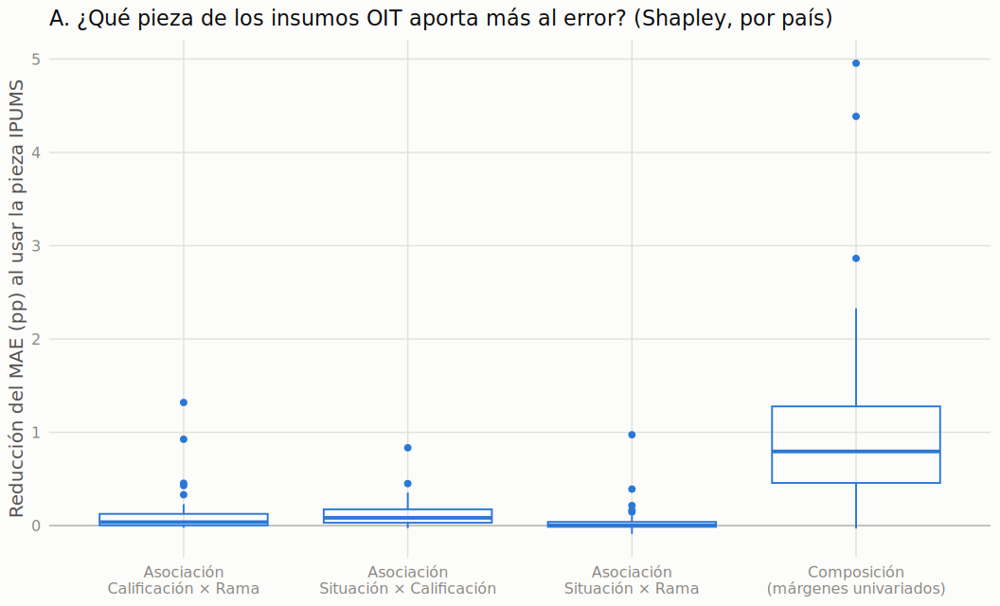
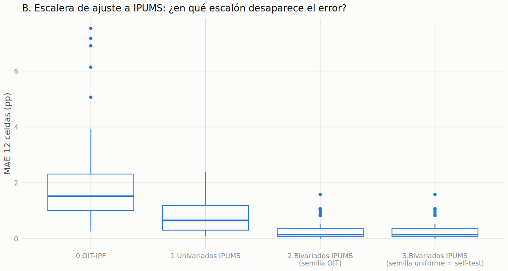
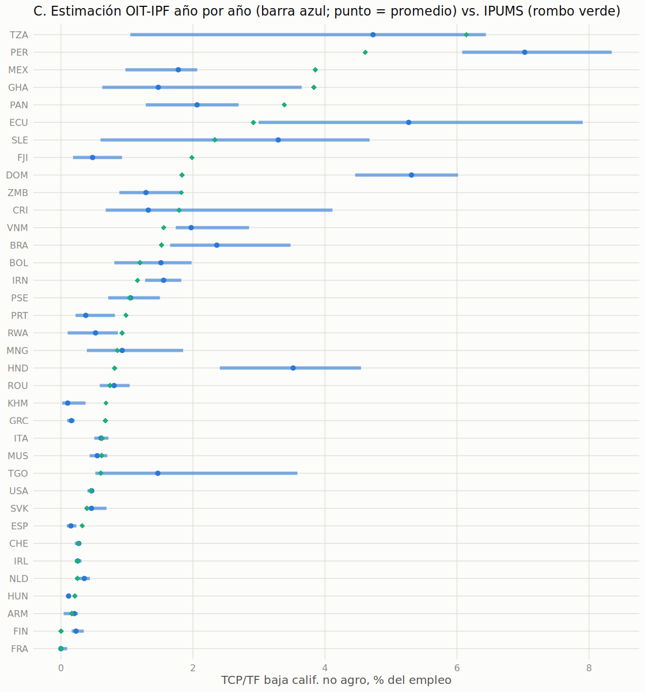

# Descomposición del error IPUMS-IPF: ¿de dónde viene la diferencia entre la estimación OIT y los censos?

*Corrida `_v3`. Scripts: `src/017_descomposicion_error_ipums.R` (partes A y B) y
`src/018_sensibilidad_temporal_ipums.R` (parte C). Insumos: `data/test_ipf/comp_raking_ipums_full_v3.csv`,
`data/test_ipf/selftest_ipf_ipums_v3.csv` y `data/raw_data/*.csv`. Salidas: `data/test_ipf/descomp_error_*_v3.csv`
y `reports/figs/fig_017_*.png`, `fig_018_*.png`.*

---

## 1. La pregunta

La estimación de TCP/TF de baja calificación no agraria se construye con el método IPF a partir de tres
tablas bivariadas de ILOSTAT. Para validarla se la comparó con una fuente externa, las muestras censales de
IPUMS (46 países con datos comparables). El resultado (informe consolidado, §2.2) es una concordancia
razonable, pero con diferencias: en las 12 celdas de la trivariada el error absoluto medio (MAE) es de
2,1 pp; en la celda de interés, de alrededor de 1 pp; y en el margen TCP/TF × No agro, de 5,7 pp.

El self-test (§2.3 del informe consolidado) ya separó esa diferencia en dos partes:

- **Error de método**: lo que el IPF se equivoca *aun con márgenes perfectos* (MAE de 0,31 pp en las 12
  celdas y de 0,38 pp en la celda de interés).
- **Error de fuente**: todo el resto, es decir, que la OIT y el censo no miden lo mismo.

Como el error de método es chico, **casi todo el error es de fuente**. Esto deja una pregunta abierta, que es
la que responde este informe:

> **¿En qué consiste el error de fuente?** ¿Qué parte de los insumos de la OIT difiere de IPUMS (cuánta gente
> hay en cada categoría, o cómo se combinan las categorías entre sí)? Y, aparte, ¿cuánto de esa diferencia
> podría deberse a que la OIT promedia varios años mientras que IPUMS es un censo de un año puntual?

Se contestó con tres experimentos:

| Parte | Pregunta | Idea |
|---|---|---|
| **A** | ¿Qué pieza de los insumos aporta el error: la *composición* o la *asociación* entre variables? | Reemplazar piezas de los insumos OIT por las de IPUMS y medir cuánto baja el error. |
| **B** | ¿En qué escalón de ajuste desaparece el error? | Escalera: ajustar progresivamente la trivariada OIT a IPUMS. |
| **C** | ¿Cuánto podría pesar el desfase temporal? | Rehacer la estimación OIT un año por vez. |

La estrategia general es **intervenir en los insumos y ver cuánto se mueve el error**, y no correlacionar
rasgos de los países con el error. Un primer chequeo por correlaciones (error contra tamaño muestral y contra
cantidad de años con dato) había dado resultados débiles y confundidos, por eso se pasó a este diseño.

---

## 2. Datos y notación

**Tablas.** La trivariada tiene tres dimensiones: calificación (Baja, Media, Alta), situación en el empleo
(Asalariado/patrón, TCP/familiar) y rama (Agro, No agro), es decir 3 × 2 × 2 = 12 celdas expresadas en % del
empleo total del país. Los insumos del IPF son sus tres tablas bivariadas (márgenes): Calificación × Situación,
Situación × Rama y Calificación × Rama.

**Dos trivariadas por país.**
- **OIT-IPF** (`raking_porc`): lo que estima el IPF a partir de las tablas de ILOSTAT (promedio de años).
- **IPUMS** (`ipums_porc`): la distribución conjunta observada en el censo. Es la referencia ("verdad").

**Celda de interés**: Baja calificación × TCP/TF × No agro.

**Medidas de error.** (i) Error con signo de la celda de interés (OIT − IPUMS); (ii) MAE de las 12 celdas,
`mean(|OIT − IPUMS|)`. Los MAE se promedian después entre países.

**Muestra.** 46 países con datos comparables. Las salidas posteriores varían ligeramente de tamaño por
exclusiones justificadas en cada parte.

---

## 3. Metodología

### 3.1 Parte A: intercambio de piezas y reparto con valores de Shapley

**Problema de diseño que obligó a rediseñar.** La idea inicial era tomar una de las tres tablas bivariadas de
IPUMS y dejar las otras dos de la OIT. Esto **no funciona**: las tres tablas comparten márgenes
univariados (por ejemplo, el total de TCP aparece en Calificación × Situación y en Situación × Rama). Si una
tabla viene de una fuente y las otras de otra, esos totales compartidos se contradicen y el IPF **no converge**
(distancia a los márgenes de 3 a 5 pp en el primer intento; los resultados eran basura, con celdas colapsadas
a ~0).

**Descomposición adoptada.** Cada tabla bivariada se separa en dos piezas:

1. **Composición**: los tres márgenes univariados (la distribución por calificación, por situación y por
   rama). Son comunes a las tres tablas.
2. **Asociación**: la estructura interna de cada tabla bivariada, es decir cómo se reparte la gente entre las
   categorías *una vez fijados los totales*. Se obtiene ajustando la tabla de la fuente elegida a la
   composición elegida (IPF de dos dimensiones, función `rake2`).

Esto da **4 piezas intercambiables**: la composición y la asociación de cada una de las 3 tablas. Con cada
pieza tomada de la OIT o de IPUMS hay 2⁴ = **16 combinaciones**. Todas son consistentes por construcción
(las tres tablas comparten los mismos márgenes univariados), así que el IPF converge.

**Para cada combinación** se construye la trivariada con IPF a partir de semilla uniforme y se mide el error
contra IPUMS. Los extremos son: todo-OIT (reproduce la estimación vigente) y todo-IPUMS (equivale al self-test).

**Reparto del error entre las 4 piezas.** Los efectos no son aditivos (el efecto de cambiar una pieza depende
de cuáles ya se cambiaron), por lo que se usa el **valor de Shapley**. Para cada orden posible de reemplazo
(24 órdenes) se mide cuánto baja el error al reemplazar la pieza *j* dado lo ya reemplazado, y se promedia
sobre todos los órdenes. Propiedad clave: las cuatro contribuciones **suman exactamente** la reducción
total del error entre todo-OIT y todo-IPUMS. Se calculó sobre dos medidas: el MAE de las 12 celdas y el
error con signo de la celda de interés.

**Exclusiones.** En 6 países (ARM, KHM, MWI, NPL, PSE, RWA) 16 de las 736 combinaciones no convergen: IPUMS
tiene celdas en cero que otra composición no puede llenar (soporte incompatible), y la celda queda en ~0. Como
el Shapley exige las 16 combinaciones válidas, estos países se **excluyen** (quedan **40**). Las 736
combinaciones, con su `gap`, están en `descomp_error_margenes_combos_v3.csv`.

### 3.2 Parte B: escalera de ajuste a IPUMS

Se parte de la trivariada OIT-IPF y se la ajusta por etapas a IPUMS:

| Escalón | Qué es |
|---|---|
| 0 | OIT-IPF tal cual. |
| 1 | Se ajusta la trivariada OIT a los **márgenes univariados** de IPUMS (conserva las razones de odds de la OIT). Cambia *cuánta gente hay* en cada categoría. |
| 2 | Se ajusta además a los **márgenes bivariados** de IPUMS, con la trivariada OIT como semilla. |
| 3 | Igual, con semilla uniforme (= self-test). |

Los escalones 2 y 3 dan prácticamente lo mismo (0,305 vs. 0,306 pp), pero **esto es trivial y no debe
leerse como un hallazgo**: la trivariada OIT-IPF sale de un IPF con semilla uniforme, por lo que su
interacción de tercer orden es nula por construcción, y partir de ella o de una semilla uniforme es
equivalente. La escalera informa entonces sobre los escalones 0 → 1 → 2/3.

### 3.3 Parte C: sensibilidad al año

La estimación vigente promedia los años disponibles de ILOSTAT (2009-2019, entre 1 y 11 años según el país),
mientras IPUMS es un censo puntual cuyo año no se conserva en el extracto. Para acotar cuánto *podría* pesar
el tiempo, se rehizo la estimación **un año por vez**:

1. Para cada país y año se toman las tres tablas bivariadas de `raw_data`, se suman las categorías finas
   *dentro* del año (la misma regla suma-antes-que-promedio que corrigió el bug de `011`), se descarta la
   categoría sin dato (`9.SD`) y se normaliza cada tabla a 100, igual que `012`.
2. Se corre el IPF (semilla uniforme) y se toma la celda de interés y el MAE de las 12 celdas.
3. Se usan solo los años presentes en las tres tablas. En los datos no hay país-años con más de una fuente,
   por lo que sumar por año no duplica casos.
4. Por país se calcula el **rango** de la celda de interés entre años (máximo − mínimo) y el **error**
   contra IPUMS de cada año.

No hace falta conocer el año del censo IPUMS: se mide cuánto cambia la estimación según el año elegido, que
es un orden de magnitud de cuánto *podría* afectar un desfase.

**Inconsistencias entre tablas.** Las tres tablas de un mismo país-año no comparten exactamente los
márgenes univariados (cobertura, categorías sin dato), por lo que el IPF no puede satisfacerlas todas: la
mediana del desajuste es de 0,10 pp. Pero en 13 de 339 país-años (ARM, BEN, BOL, BWA, NLD, PSE, RWA, SEN, TZA)
supera 1 pp (hasta 26 pp en SEN, 14 en TZA y 12 en RWA). Ahí la trivariada deja de ser interpretable. Los
resultados se reportan **con y sin** esos 13 país-años (criterio: desajuste ≤ 1 pp); la conclusión no cambia.
Es el mismo límite del método ya documentado para Senegal y otros países en el testeo R vs. Python.

### 3.4 Verificaciones realizadas

| Chequeo | Resultado |
|---|---|
| Combinación todo-OIT (A) vs. `raking_porc` | Diferencia máxima 0,021 pp (por `ipf_nd` propio vs. `mipfp`). |
| Combinación todo-IPUMS (A) vs. self-test de `015` | Diferencia máxima 9 × 10⁻¹⁰ pp. |
| Suma de las 4 contribuciones de Shapley vs. reducción total del error | Diferencia máxima 1,8 × 10⁻¹⁵. |
| Convergencia de las 736 combinaciones de A | 720 convergen (desajuste < 10⁻⁴); las 16 restantes son las excluidas. |
| Parte C: promedio simple de las celdas por año vs. estimador vigente | Diferencia media 0,09 pp (máx. 0,98). Es esperable cierta diferencia porque el IPF no es lineal. |

---

## 4. Resultados

### 4.1 Parte A: la composición explica la mayor parte del error de fuente

**Reducción del MAE de las 12 celdas al reemplazar cada pieza por la de IPUMS (Shapley, 40 países).**
La reducción total entre todo-OIT y todo-IPUMS es en promedio de 1,41 pp.

| Pieza | Media (pp) | Mediana | Rango intercuartil | Máximo | Países con contribución negativa |
|---|---:|---:|---|---:|---:|
| **Composición (márgenes univariados)** | **1,10** | **0,80** | 0,46 a 1,28 | 4,96 (SLE) | 1 |
| Asociación Situación × Calificación | 0,13 | 0,08 | 0,03 a 0,18 | 0,83 | 3 |
| Asociación Calificación × Rama | 0,13 | 0,04 | 0,00 a 0,13 | 1,32 | 4 |
| Asociación Situación × Rama | 0,05 | 0,004 | −0,01 a 0,04 | 0,97 | 16 |



- **La composición explica alrededor del 78 % de la reducción agregada del error** (82 % en el país mediano) y es la
  pieza dominante en **38 de 40 países**. En las dos excepciones pesa más una asociación: Calificación × Rama
  en un país y Situación × Calificación en el otro.
- Las tres asociaciones juntas aportan ~0,3 pp: su efecto es chico y concentrado en pocos países. La asociación
  Situación × Rama casi no aporta (mediana ≈ 0; contribuye negativamente en 16 países, es decir, a veces
  la tabla de IPUMS empeora la estimación).
- Los países con mayor aporte de la composición son SLE (4,96 pp), KEN (4,39), SEN (2,86), DOM (2,33), PRT (1,97),
  USA (1,86), TGO (1,82) y HND (1,64).

**Celda de interés (error con signo, pp).** El error total medio de la celda en estos 40 países es +0,45 pp (el
valor absoluto medio es 1,15 pp). Las contribuciones por pieza son mucho más dispersas y de signo mixto:

| Pieza | Media | Mediana | Percentil 10 a 90 |
|---|---:|---:|---|
| Composición | +0,65 | +0,12 | −0,11 a +1,95 |
| Asociación Situación × Calificación | +0,28 | +0,004 | −0,90 a +1,40 |
| Asociación Calificación × Rama | −0,15 | 0,00 | −0,90 a +0,47 |
| Asociación Situación × Rama | −0,03 | −0,001 | −0,19 a +0,11 |

Dos cosas importan al leer esta tabla. Primero, las **medianas son cercanas a cero** y los promedios están
tirados por pocos países: en la mayoría el error de la celda de interés ya es chico y ninguna pieza lo mueve.
Segundo, las contribuciones de la asociación **se cancelan entre países** (hay países donde empujan hacia arriba y otros
hacia abajo), así que sus promedios con signo subestiman su importancia real: por eso se incluye el
valor absoluto mediano (0,20 pp para Situación × Calificación, 0,15 para Calificación × Rama, 0,16 para la
composición y 0,04 para Situación × Rama).

### 4.2 Parte B: con solo igualar los márgenes univariados el error cae a menos de la mitad

**Promedio sobre 46 países.**

| Escalón | MAE 12 celdas (pp) | MAE celda de interés (pp) | Sesgo celda de interés (pp) |
|---|---:|---:|---:|
| 0. OIT-IPF | 2,11 | 1,07 | +0,32 |
| 1. + márgenes univariados de IPUMS | 0,83 | 0,62 | −0,30 |
| 2. + márgenes bivariados de IPUMS (semilla OIT) | 0,31 | 0,38 | −0,33 |
| 3. + semilla uniforme (= self-test) | 0,31 | 0,38 | −0,33 |



- Alcanza con igualar *cuánta gente hay en cada categoría* para pasar de 2,11 a 0,83 pp de MAE (**−61 %**) y
  de 1,07 a 0,62 pp en la celda de interés. El MAE de las 12 celdas baja en 45 de los 46 países.
- Llegar al piso del método (0,31 pp) requiere además ajustar las asociaciones bivariadas (−0,52 pp más).
- **La celda de interés mejora menos y no en todos lados**: su error con el escalón 1 sube en 27 de los 46 países
  (ajustar solo los márgenes univariados puede acercar el conjunto pero alejar una celda particular).
  Que el sesgo cambie de +0,32 a −0,30 pp indica que la composición de la OIT *sobreestima* levemente la
  celda y que, una vez corregida, queda el sesgo de subestimación estructural del método (−0,33 pp, §2.3 del
  informe consolidado).
- Los escalones 2 y 3 son idénticos por construcción (ver §3.2).

**Esto coincide con la parte A** con otra técnica: la composición es la fuente principal del desacuerdo.

### 4.3 Parte C: el desfase temporal explica diferencias de ~1 pp, no las grandes

**Cobertura temporal.** De los 46 países, 23 tienen 11 años comparables; 9, un solo año; y 14 tienen entre 2 y
10. Solo los 36 con dos años o más permiten evaluar sensibilidad (son los que se resumen abajo, sin los
país-años inconsistentes).

| Medida (celda de interés, 36 países) | Valor |
|---|---:|
| Error absoluto con el promedio de años, mediana (media) | 0,41 pp (0,76) |
| Rango de la celda entre años, mediana (media; percentil 90; máximo) | 0,75 pp (1,26; 3,25; 5,39 en TZA) |
| Razón rango entre años / error con el promedio, mediana | 2,13 |
| Países donde algún año reproduce a IPUMS (el error cambia de signo) | 17 de 36 |
| Spearman entre error con el promedio y rango entre años | 0,75 |



- **Para errores chicos el tiempo es suficiente.** El rango entre años (0,75 pp) es casi el doble del error típico
  (0,41 pp), y en 17 de 36 países existe algún año cuya estimación coincide con (o cruza) el valor de IPUMS.
  Entre los 19 países donde ningún año llega a IPUMS, la distancia mínima es de solo 0,18 pp en la mediana.
- **Para errores grandes no.** Solo **5 países** quedan a más de 1 pp de IPUMS en *todos* los años: DOM
  (error de +2,6 a +4,2 pp según el año), HND (+1,6 a +3,7), PER (+1,5 a +3,7), MEX (−2,9 a −1,8) y FJI
  (−1,8 a −1,1). Ahí el año elegido no resuelve nada. En Senegal (excluido del cálculo por inconsistencia
  de tablas, pero con la misma lectura con todos los años) el error ronda los +7,7 a +10 pp en todos los años.
- **Relación con la longitud de la serie.** En los 27 países con 9 o más años el rango mediano entre años baja a
  0,45 pp y el error mediano con el promedio a 0,32 pp, pero la proporción donde algún año reproduce a IPUMS no
  sube (12 de 27): más años no acerca más a IPUMS.
- **Correlación 0,75 entre error y rango.** Los países cuya estimación varía más entre años son los que
  tienen más error. Es compatible con el desfase temporal, pero también con inestabilidad de las encuestas, y
  parte del vínculo es mecánico: una celda que se mueve mucho tiene más posibilidades de pasar cerca de IPUMS
  y, a la vez, de promediar lejos de cualquier año. Por eso se lee como **compatible con** el desfase, no como
  prueba.

---

## 5. Síntesis e implicancias

1. **El error de fuente es, ante todo, un error de composición.** Las fuentes (encuestas OIT y censos IPUMS)
   discrepan sobre *cuánta gente* hay en cada categoría (cuánto agro, cuánta baja calificación, cuántos
   TCP/TF) mucho más de lo que discrepan sobre *cómo se combinan* esas categorías: la composición explica ~78 %
   de la reducción del error y alcanza para reducir el MAE en un 61 %. La estructura de asociación aporta un
   efecto chico, con una cola de países puntuales.
2. **Consecuencia práctica.** La técnica IPF no es el problema (el método mueve ~0,3 pp). Mejorar la
   estimación depende sobre todo de los **márgenes univariados** de entrada, no del algoritmo. Este análisis no
   identifica *qué* categoría de esos márgenes (agro, baja calificación o TCP/TF) concentra la diferencia;
   las definiciones de rama agrícola y de calificación son candidatas, pero habría que auditarlo (§7). Es
   coherente con el diagnóstico previo de que el desacuerdo está antes del IPF (§2.4 del informe consolidado).
3. **El desfase temporal es una explicación de segundo orden.** Puede explicar diferencias del orden de
   ~1 pp en la celda de interés (la mitad de los países tiene algún año que coincide con IPUMS), pero no los
   desacuerdos mayores (DOM, HND, PER, MEX, Senegal), que persisten en todos los años.
4. **Cómo leer la estimación.** Para la celda de interés, el error típico (mediana 0,4 pp) es chico frente a la
   magnitud de los fenómenos que se quieren comparar entre clusters y regiones (informe consolidado, §3); la
   incertidumbre se concentra en pocos países con desacuerdos de fuente de 2 a 8 pp. Los resultados *por país*
   de DOM, HND, PER, MEX y Senegal deben leerse con cautela. Cuánto afectan esos países a los agregados por
   cluster y región no se evaluó aquí.

---

## 6. Limitaciones

- **Una sola fuente de referencia.** IPUMS tampoco es "la verdad": difiere de la OIT en definiciones (pregunta
  censal de clase de trabajador vs. encuesta de fuerza de trabajo), en el cruce de ocupaciones a niveles de
  calificación y en la cobertura. La descomposición dice *dónde* difieren, no *cuál* de las dos fuentes
  acierta.
- **Muestra chica.** 46 países (40 en el Shapley, 36 en la parte C). Los promedios están tirados por pocos
  países; se informan medianas y rangos para que eso se vea. No se hicieron tests de significancia.
- **Composición no es causa.** Que la composición explique la mayor parte del error no dice *por qué* difiere
  (definiciones, cobertura, año, ponderadores). Es un diagnóstico, no una explicación causal.
- **Efecto de la exclusión.** Los 6 países excluidos del Shapley (ARM, KHM, MWI, NPL, PSE, RWA) tienen celdas
  en cero en IPUMS; la conclusión sobre la composición vale para los 40 restantes.
- **Parte C acotada a 2009-2019.** Si el censo IPUMS de un país cae fuera de esa ventana, no se capta; y
  9 países con un solo año comparable no pueden evaluarse. Tampoco se sabe en qué año cae cada censo (el extracto
  no lo conserva), por lo que no se puede medir el desfase real, solo su orden de magnitud posible.
- **Definición de "consistente" en C.** El umbral de 1 pp para descartar país-años es una decisión de este
  análisis; la conclusión no cambia sin el filtro (con todos los país-años: mediana del error 0,42 pp y
  del rango 0,80 pp; 18 de 37 países cruzan a IPUMS).

---

## 7. Próximos pasos posibles

1. **Recuperar el año censal** de IPUMS por país (pendiente 2 de `CLAUDE.md`; requiere los microdatos
   crudos) para medir el desfase real en lugar de su cota.
2. **Auditar los márgenes univariados** en los países con mayor aporte de la composición (SLE, KEN, SEN, DOM,
   PRT, USA, TGO, HND): ¿qué categoría (agro, baja calificación, TCP) concentra la diferencia? Esto
   permitiría distinguir un problema de definición de uno de cobertura.
3. **Corregir el sesgo** con un factor derivado del self-test (−0,33 pp), ahora que se sabe que además hay
   un sesgo de composición de signo contrario (+0,32 pp antes de ajustar los márgenes).

---

## 8. Reproducibilidad

```
LC_ALL=C.UTF-8 Rscript src/017_descomposicion_error_ipums.R    # partes A y B (unos minutos)
LC_ALL=C.UTF-8 Rscript src/018_sensibilidad_temporal_ipums.R   # parte C
```

Correr desde la raíz del repositorio. Requiere `dplyr`, `tidyr`, `purrr`, `readr`, `ggplot2` y `tibble` (los
mismos que `015`). Ambos aceptan `--sufijo` (por defecto `_v3`) para leer otra corrida de `015`.
