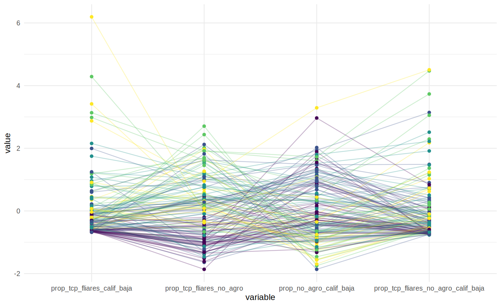

# TCP/TF de baja calificación no agro: resultados por cluster, ingreso y región

*Fuente: `data/estimacion/tabla_tcps_final_sums.csv` (181 países). Script: `src/014_tcp_estancada_analysis.R`.
Todos los valores son medias ponderadas por `prop_ocup_totales` (peso poblacional de cada país).*

La celda de interés del proyecto es **"Prop. TCP fliares no agro calif. baja"**: trabajadores por cuenta
propia y familiares, de baja calificación, en ramas no agrícolas, como % del empleo total.

## Por cluster PIMSA

| Cluster | TCP/TF totales | TCP/TF calif. baja | TCP/TF no agro | **TCP/TF no agro calif. baja** |
|---|---:|---:|---:|---:|
| C1. Cap. avanzado | 9,5% | 0,7% | 8,2% | **0,6%** |
| C2. Cap. extensión reciente c/desarrollo profundidad | 28,3% | 3,6% | 21,6% | **2,1%** |
| C3. Cap. extensión c/peso campo | 43,0% | 5,2% | 21,5% | **1,9%** |
| C4. Cap. escasa extensión c/peso campo | 70,2% | 17,8% | 29,4% | **6,2%** |
| C5. Pequeña propiedad en el campo | 79,3% | 11,7% | 19,0% | **3,1%** |

Gradiente claro y monótono entre C1 y C4: a menor desarrollo de las capacidades productivas, mayor peso del
TCP/TF total y de su fracción de baja calificación no agro (0,6% → 6,2%, un salto de 10x entre extremos).
C5 rompe la monotonía porque su alto TCP/TF total es sobre todo agrícola (queda fuera de la celda de
interés); su fracción no agro de baja calificación (3,1%) es menor a la de C4 pese a tener el mayor TCP/TF
total del grupo.

## Por grupo de ingreso

| Grupo | TCP/TF calif. baja | TCP/TF no agro | **TCP/TF no agro calif. baja** |
|---|---:|---:|---:|
| 01 Altos ingresos | 1,0% | 10,0% | **0,8%** |
| 02 Medios-altos ingresos | 3,8% | 16,9% | **1,8%** |
| 03 Medios-bajos ingresos | 14,3% | 27,2% | **5,0%** |
| 04 Bajos ingresos | 11,6% | 20,6% | **3,2%** |

Relación no lineal: el pico está en los países de ingreso medio-bajo (5,0%), no en los más pobres (3,2%).
Consistente con el patrón por cluster (C4 > C5): la mayor presencia de TCP/TF de baja calificación no
agrícola aparece donde ya hay una economía urbana no agrícola de peso pero con escasa capacidad de
absorción formal, más que en las economías de ingreso más bajo, donde el trabajo por cuenta propia de baja
calificación es todavía predominantemente agrícola.

## Por región

| Región | TCP/TF calif. baja | TCP/TF no agro | **TCP/TF no agro calif. baja** |
|---|---:|---:|---:|
| South Asia | 18,4% | 30,4% | **7,1%** |
| Sub-Saharan Africa | 10,6% | 22,2% | **3,8%** |
| Latin America & Caribbean | 5,2% | 23,6% | **2,6%** |
| East Asia & Pacific | 7,3% | 19,3% | **1,6%** |
| Middle East & North Africa | 3,2% | 17,1% | **1,7%** |
| Europe & Central Asia | 1,0% | 9,6% | **0,3%** |
| North America | 0,5% | 6,0% | **0,5%** |

South Asia y Sub-Saharan Africa concentran, por lejos, los valores más altos de la celda de interés (7,1% y
3,8%); Europa/Asia Central y Norteamérica los más bajos (≤0,5%). América Latina queda en un nivel intermedio
(2,6%), por debajo de África Subsahariana pese a tener un TCP/TF no agro total similar o mayor — su
composición está más volcada a calificaciones media/alta.

## Gráfico de conjunto

Cada línea es un país (color = cluster); los cuatro ejes son, de izquierda a derecha, TCP/TF calif. baja,
TCP/TF no agro, no agro calif. baja (margen), y la celda de interés (TCP/TF no agro calif. baja). Los outliers
por arriba (líneas amarillas/verdes que se disparan) corresponden a los mismos pocos países con valores
extremos que ya aparecían como outliers en la prueba de validación contra IPUMS.

## Lectura teórica: TCP/TF de baja calificación no agraria como superpoblación estancada

El indicador que se releva acá es, como plantea la introducción del proyecto, un **piso mínimo** de la
superpoblación relativa urbana disfrazada de trabajo por cuenta propia: se restringe deliberadamente a las
"ocupaciones elementales" (grupo 9 de la CIUO-08) para no forzar la hipótesis, dejando afuera —indiscriminada
en la calificación media— a buena parte de la capa que también podría leerse como proletaria (talleristas,
choferes, comerciantes menores, repartidores en moto en vez de bicicleta, etc.). Lo que el gradiente empírico
por cluster, ingreso y región permite es poner a prueba, con ese piso, si la distribución del fenómeno sigue
la lógica que la teoría anticiparía para la forma **estancada** de la superpoblación relativa, y no otra.

Marx caracteriza a la superpoblación estancada por una ocupación "sumamente irregular", condiciones de vida
"por debajo del nivel medio normal de la clase obrera" y una disposición a aceptar el "máximo de tiempo de
trabajo" por el "mínimo de salario" —rasgos que la hacen, a la vez, "campo de reclutamiento" inagotable para
el capital y depósito de una población que éste ya no necesita regularizar. A diferencia de la superpoblación
**flotante** (la que rota dentro y fuera del empleo asalariado regular en los propios centros de la gran
industria) y de la **latente** (la que la penetración capitalista todavía no termina de expulsar del campo,
manteniéndola dentro de la agricultura como fuerza de trabajo virtualmente disponible), la estancada es
precisamente la que ya fue separada de sus medios de vida agrarios pero **no** fue absorbida por el trabajo
asalariado regular: queda flotando en los intersticios urbanos y semi-urbanos, y el "cuentapropismo" de baja
calificación —el cartonero, el repartidor, el vendedor ambulante, el changarín (subgrupos 91-96 de la CIUO-08
listados en la introducción)— es una de sus formas fenoménicas más visibles, aunque estadísticamente quede
emplastada bajo la misma categoría que el pequeño propietario exitoso.

Leído así, el gradiente por cluster PIMSA (C1→C4: 0,6% → 6,2%) no es simplemente "más pobreza, más
cuentapropismo": es un gradiente en la **capacidad del capital para absorber, en trabajo asalariado regular,
a la población que su propia extensión separa de los medios de vida agrarios**. Cuanto menor esa capacidad
relativa de absorción (C4: "extensión escasa"), mayor la fracción de esa población que queda flotando como
estancada en circuitos urbanos no agrarios de baja calificación, en vez de ser regularizada como asalariada.
C5 ("pequeña propiedad en el campo") rompe la monotonía porque ahí la separación respecto de los medios de
vida agrarios todavía no se completó del todo: la superpoblación sigue estando, en los términos de la teoría,
predominantemente en su forma **latente** (retenida dentro del campo, con TCP/TF total alto pero mayormente
agrícola) más que en su forma estancada no agraria —de ahí que su celda de interés (3,1%) sea menor a la de
C4 pese a tener el TCP/TF total más alto de todos los clusters.

La misma lógica explica el pico no monótono por ingreso (medio-bajo, no el más pobre) y la concentración
regional en South Asia y Sub-Saharan Africa: son las zonas donde el proceso de expulsión agraria ya avanzó lo
suficiente como para generar una masa urbana considerable, pero donde la industrialización y el empleo
asalariado formal no crecieron al mismo ritmo para absorberla. En los países de ingreso más bajo, en cambio,
esa masa todavía tiende a estar retenida como superpoblación latente dentro del propio campo; y en los países
de ingreso alto (Europa/Asia Central, Norteamérica), la capacidad de absorción asalariada —o, alternativamente,
la cobertura de protecciones que regularizan aun al cuentapropismo residual— reduce la celda casi a cero. El
patrón, en suma, es compatible con leer al TCP/TF de baja calificación no agraria no como una capa de pequeños
empresarios en potencia, sino como una expresión estadística —parcial y necesariamente subestimada, por la
restricción a ocupaciones elementales— de la superpoblación relativa estancada.

### Síntesis empírica

- El gradiente por cluster PIMSA es el patrón más nítido: de C1 a C4 la celda de interés crece de forma
  monótona y en un orden de magnitud (0,6% → 6,2%); C5 rompe la monotonía por el peso todavía agrario de su
  TCP/TF.
- Por ingreso, la relación no es monótona: el pico está en ingreso medio-bajo, no en el más pobre.
- Por región, South Asia y Sub-Saharan Africa concentran los valores más altos; el resto del mundo queda muy
  por debajo, con Europa/Asia Central y Norteamérica cerca de cero.
- Los tres cortes son consistentes entre sí y con la lectura teórica: la sobre-representación de TCP/TF de
  baja calificación no agrícola no es un fenómeno de "pobreza de país" sin más, sino que sigue la lógica de
  dónde la separación respecto de los medios de vida agrarios ya avanzó pero la absorción asalariada regular
  todavía no la siguió.
